HOL-4: Exercise 2: Explore the management of your Azure Stack HCI 22H2 environment
==============
Overview
-----------
With the Azure Stack HCI cluster deployed, you can now begin to explore some of the additional capabilities within Azure Stack HCI 22H2 and Windows Admin Center. We'll cover a few recommended activities below, to expose you to some of the key elements of the Windows Admin Center, but for the rest, we'll [direct you over to the official documentation](https://learn.microsoft.com/en-us/azure-stack/hci/ "Azure Stack HCI 22H2 documentation").

Contents
-----------
- [HOL-4: Exercise 2: Explore the management of your Azure Stack HCI 22H2 environment](#hol-4-exercise-2-explore-the-management-of-your-azure-stack-hci-22h2-environment)
  - [Overview](#overview)
  - [Contents](#contents)
  - [Task 1: Explore the existing volumes created on the **hciboxcluster**](#task-1-explore-the-existing-volumes-created-on-the-hciboxcluster)
    - [Review a two-way mirror volume created to run VMs](#review-a-two-way-mirror-volume-created-to-run-vms)
  - [Task 2: Download .Iso files](#task-2-download-iso-files)
    - [Download a Windows Server 2022 .Iso](#download-a-windows-server-2022-iso)
    - [Download an Ubuntu Server 22.04 .Iso](#download-an-ubuntu-server-2204-iso)
    - [Upload the .Iso files to your CSV](#upload-the-iso-files-to-your-csv)
  - [Task 3: Deploy a Windows Server 2022 virtual machine](#task-3-deploy-a-windows-server-2022-virtual-machine)
  - [Task 4: Deploy an Ubuntu Server 22.04 virtual machine (OPTIONAL)](#task-4-deploy-an-ubuntu-server-2204-virtual-machine-optional)
  - [Task 5: Live migrate a virtual machine to another node](#task-5-live-migrate-a-virtual-machine-to-another-node)
  - [Congratulations!](#congratulations)
  - [Setup the lab in your own Azure Subscription.](#setup-the-lab-in-your-own-azure-subscription)

Task 1: Explore the existing volumes created on the **hciboxcluster**
-----------
In this step, you'll review a volume on the Azure Stack HCI 22H2 cluster by using Windows Admin Center, and enable data deduplication and compression.

### Review a two-way mirror volume created to run VMs ###

1. Open **Windows Admin Center** on the **AdminCenter** VM. On the top left click on **All connections** and click on your previously deployed cluster, **hciboxcluster.jumpstart.local**

    
    
        
2. On the left hand navigation, under **Cluster resources** select **Volumes**.  The central **Volumes** page shows you should have two volume currently

    
    
4. On the Volumes page, select the **Inventory** tab, and then select **Create**

    
    
6. Open the volume **S2D_vDISK1**, by clicking on the name of the volume. We see a couple of things now:
   - The Volume File system is a **Cluster Shared Volume** of type **ReFS**
     - *Please read more:* 
       - https://learn.microsoft.com/en-us/azure-stack/hci/concepts/plan-volume
       - https://learn.microsoft.com/en-us/azure-stack/hci/concepts/storage-spaces-direct-overview)
   - The Resiliency was set to **Two-way mirror**
     - *Please read more:*
       - https://learn.microsoft.com/en-us/azure-stack/hci/concepts/fault-tolerance)
   - Deduplication and Encryption is **Off**
     - *Please read more:*
       - https://learn.microsoft.com/en-us/azure-stack/hci/manage/volume-encryption-deduplication
   - Also have a look at the Capacity and Performance indicators

    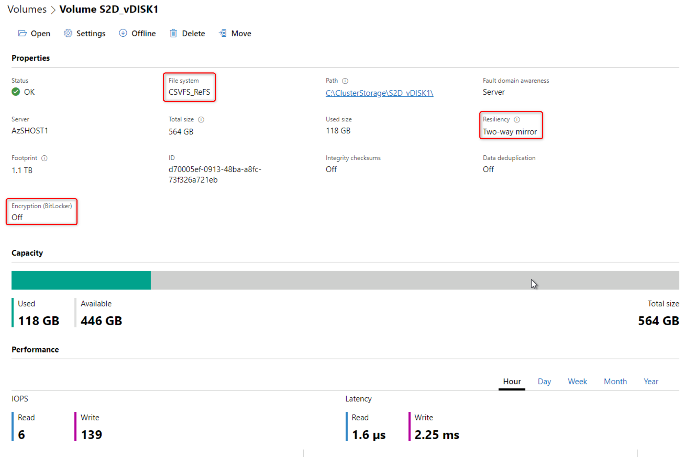
  
7. On the volume S2D_vDISK1 page click on **Settings**. You will notice that the volume S2D_vDISK1 has been provisioned as a type Fixed, but Thin provisioning of volumes is also available.
   - *Please read more:*
     - https://learn.microsoft.com/en-us/azure-stack/hci/manage/thin-provisioning

    

You now have reviewed and learned more about Azure Stack HCI volumes which are ready to accept workloads. 
Here is the official documentation on how to create volumes on Azure Stack HCI, leveraging Windows Admin Center or PowerShell: https://learn.microsoft.com/en-us/azure-stack/hci/manage/create-volumes

Task 2: Download .Iso files
-----------
In this step, you will download a Windows Server 2022 and Ubuntu Server 22.04 .Iso file and upload the .Iso to your Clustered Shared Volume you explored in Task 1. 

**_NOTE:_**  Make sure to use the Edge browser on the **AdminCenter** VM to execute the following steps.

### Download a Windows Server 2022 .Iso ###

1. Please download Windows Server 2022 image file from [here](https://www.microsoft.com/en-us/evalcenter/download-windows-server-2022)
 
1. In the English (United States) row select the Click **64-bit edition** in the ISO downloads row. Download the .iso which will be by saved in the Downloads folder.

### Download an Ubuntu Server 22.04 .Iso ### 
 
1. Please download Ubuntu Server 22.04 image file from [here](https://releases.ubuntu.com/jammy/ubuntu-22.04.2-live-server-amd64.iso)
 
1. The download of the ISO file should automatically start. Once completed you should find it in your Downloads folder.

### Upload the .Iso files to your CSV ###
 
1. Open **Windows Admin Center** on **AdminCenter** VM from the desktop if it is not already opened, click on your previously deployed cluster, **hciboxcluster.jumpstart.local**
 
    
 
1. On the left hand navigation, under **Cluster Resources** select **Servers** and then **Inventory**.
 
    

1. Select node AzSHOST1 and then click **Manage**
 
    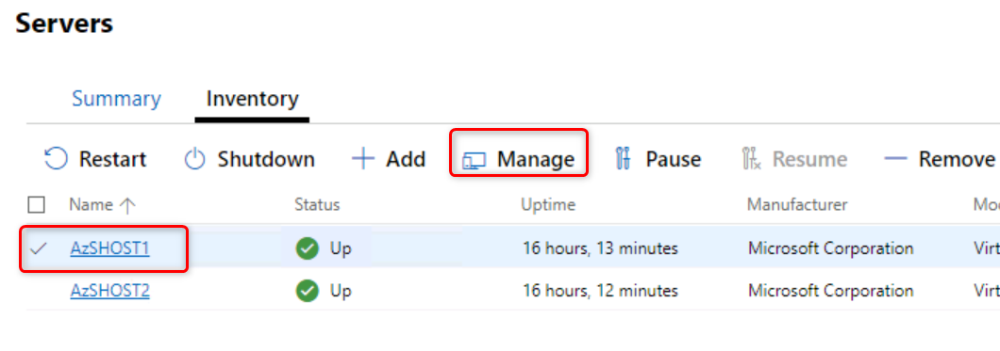
 
1. On the left, select **Files & file sharing**. Open the folder **C:\ClusterStorage\S2D_vDISK1**
  
    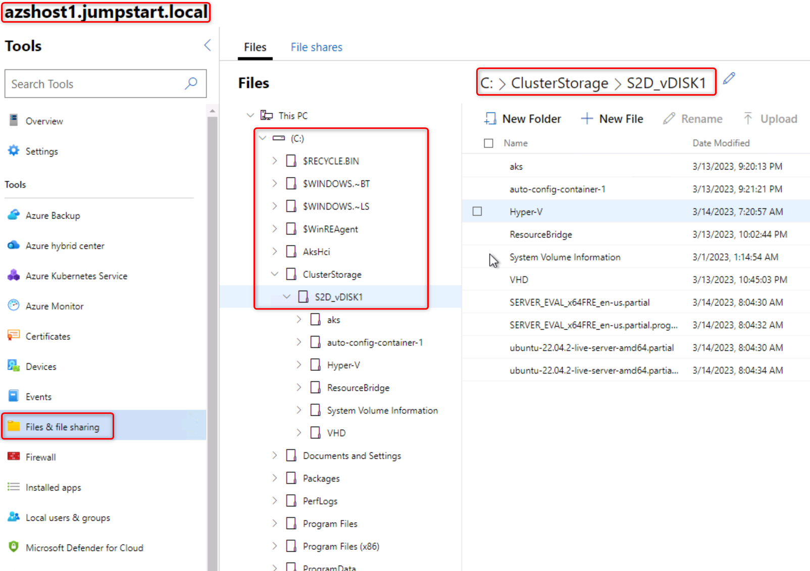
 
1. Click **Upload**. Click **Select Files**, search and select both (Windows Server 2022 and Ubuntu Server 22.04) .iso files in the Downloads directory and click **Open**, and then **Submit**. 
 
    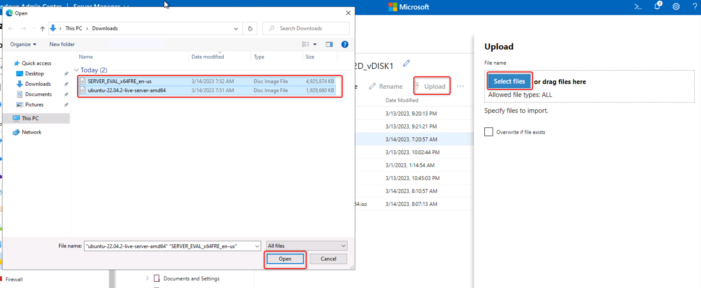
  
**NOTE:** It can take up to around 5-10 minutes to get both .ISO files successfully uploaded. After that, please move on to the next task.

Task 3: Deploy a Windows Server 2022 virtual machine
----- 
In this step, you will deploy a Windows Server 2022 virtual machine via Windows Admin Center.

1. Once logged into the **Windows Admin Center** on the **AdminCenter** VM, click on your previously deployed cluster, **hciboxcluster.jumpstart.local**

3. On the left hand navigation, under **Cluster Resources** select **Virtual machines**.  The central **Virtual machines** page shows that there are some virtual machines already running.
    
    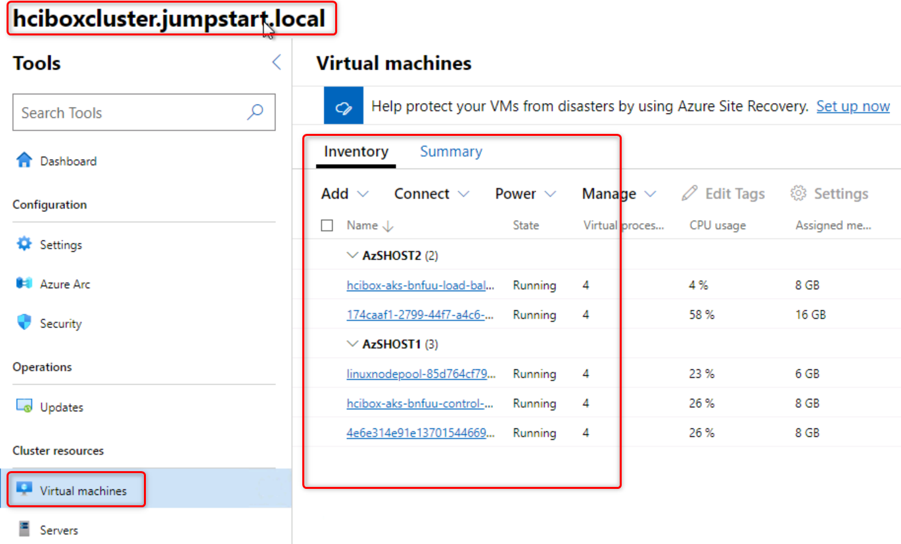

4. On the **Virtual machines** page, select the **Inventory** tab, and then click on **Add** and select **New**.

    

6. In the **New virtual machine** pane, enter **VM001** for the name, and enter the following pieces of information, then click **Create**

 
     * Generation: **Generation 2 (Recommended)**
     * Host: **Leave as recommended**
     * Path: **C:\ClusterStorage\S2D_vDISK1**
     * Virtual processors: **2**
     * Startup memory (GB): **4**
     * Use dynamic memory: **Min 2, Max 6**
     * Network: **sdnSwitch**
     * Storage: **Add, then Create an empty virtual hard disk** and set size to **30GB**
     * Operating System: Install an operating system from an image file (.iso). Select the Windows Server 2022 Iso file!

    
      
    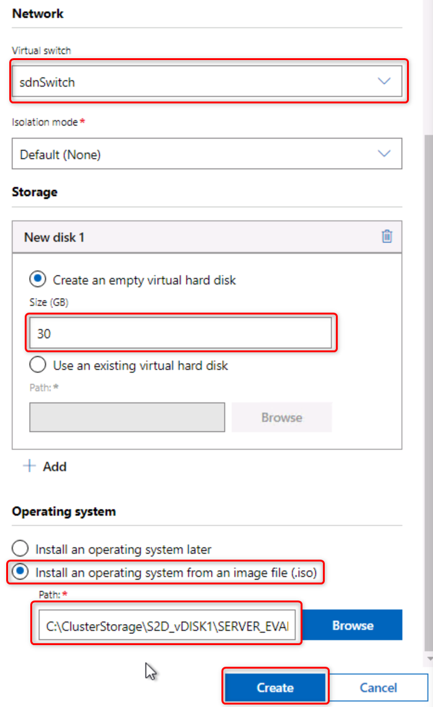
 
 
5. The creation process will take a few moments, and once complete, VM001 should show within the Virtual machines view

6. Click on the checkbox before VM001 and then click on **Power** and select **Start** - within moments, the VM should be running.

    
    
  
7. Click on VM001 to view the properties and status for this running VM.
 
    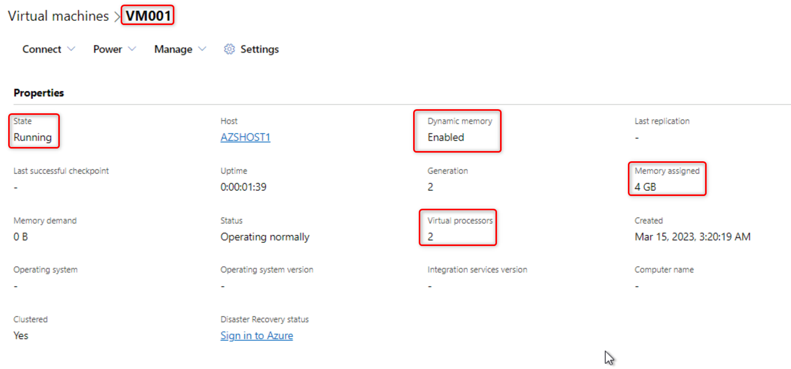

8. Click on Connect and select connect button from the drop down.

    
 
9. Fill in the Username **arcdemo@jumpstart.local** and password **ArcPassword123!!**. Before clicking on **Connect** first make sure to click the checkbox before "Automatically connect with the certificate presented by this machine", when you receive the certificate prompt, click **Confirm**. Now click **Connect**.
  
     
 
10. The VM will be in the UEFI boot summary as below
 
     
 
11. Click in "Send Ctrl + Alt + Del" at the top of the page now and press any key when you see the message "Press any key at boot from CD or DVD…"
 
     
 
13. From there you'll start the OOBE experience. Select the following settings according to your preferences: Language, Time currency and Keyboard. Click **Next**

14. Click Install Now, and select the version Windows Server 2022 Standard Evaluation (Desktop Experience). Click **Next**
 
     
 
15. Accept the license terms. Click **Next**. Select "Custom: Install Windows only (advanced)" and then Next. It will take around 10 minutes for the VM to boot. After that, please insert the lab credentials **ArcPassword123!!** and your VM is ready to go!

Task 4: Deploy an Ubuntu Server 22.04 virtual machine (OPTIONAL)
----- 
In this step, you will deploy an Ubuntu Server 22.04 virtual machine via Windows Admin Center.

1. Once logged into the **Windows Admin Center** on the **AdminCenter** VM, click on cluster, **hciboxcluster.jumpstart.local**

3. On the left hand navigation, under **Cluster Resources** select **Virtual machines**.  The central **Virtual machines** page shows that there are some virtual machines already running.
    
    

4. On the **Virtual machines** page, select the **Inventory** tab, and then click on **Add** and select **New**.

    

6. In the **New virtual machine** pane, enter **VM002** for the name, and enter the following pieces of information, then click **Create**

 
     * Generation: **Generation 2 (Recommended)**
     * Host: **Leave as recommended**
     * Path: **C:\ClusterStorage\S2D_vDISK1**
     * Virtual processors: **1**
     * Startup memory (GB): **2**     
     * Network: **sdnSwitch**
     * Storage: **Add, then Create an empty virtual hard disk** and set size to **20GB**
     * Operating System: Install an operating system from an image file (.iso). Select the Ubuntu Server 22.04 Iso file!

    
      
    
 
 
5. The creation process will take a few moments, and once complete, VM002 should show within the Virtual machines view

1. Click on the VM name **VM002** and then Click on **Settings** to view all VM properties. Click on **Security**
 
    

1. Make sure to change the Secure Boot template to "Microsoft UEFI Certificate Authority" in the Template drop down box, and click **save security settings**. DO NOT CLICK **Close**.

    

1. Click **Networks** in the left menu under "Settings for VM002" and make sure to change the VLAN identifier to **200** and click **save Networks settings**. Click Close.

    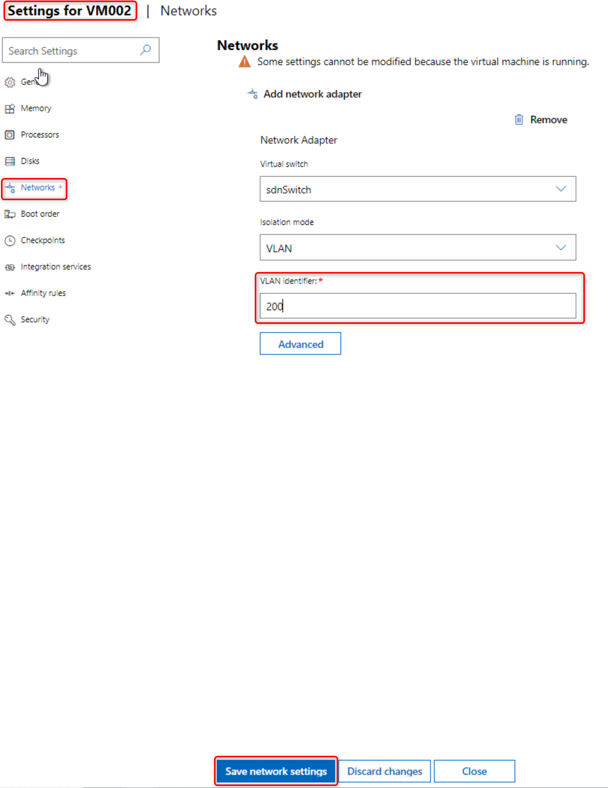

6. Click on **Power** and select **Start** - within moments, the VM should be running.

    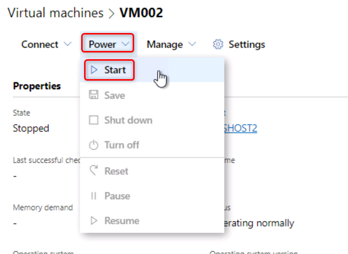
    
  
7. View the properties and status for this running VM.
 
    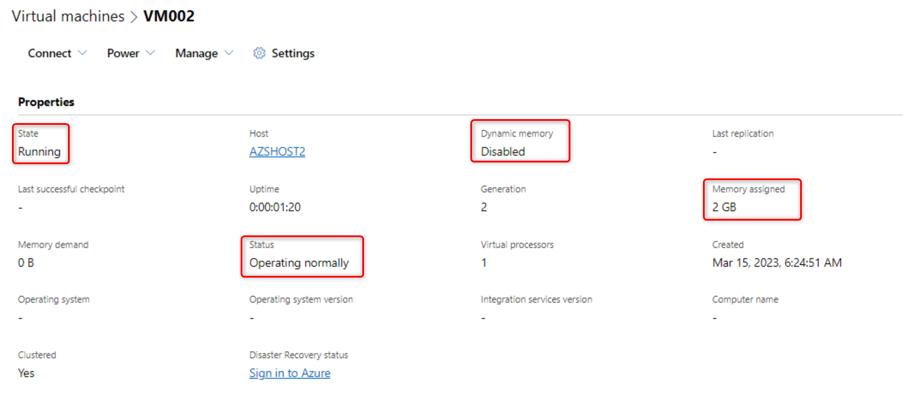
    

8. Click on Connect and select connect button from the drop down.

    
 
9.  Fill in the Username **arcdemo@jumpstart.local** and password **ArcPassword123!!**. Before clicking on **Connect** first make sure to click the checkbox before "Automatically connect with the certificate presented by this machine", when you receive the certificate prompt, click **Confirm**. Now click **Connect**.
  
    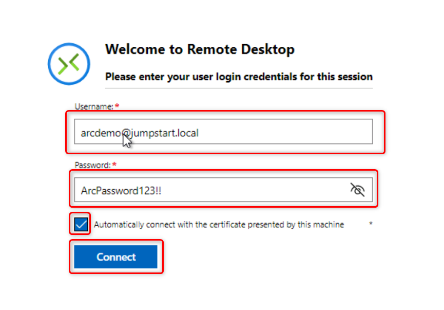 
 

1. Once the integrity check is done you will be able to select your language. Select **English**.

    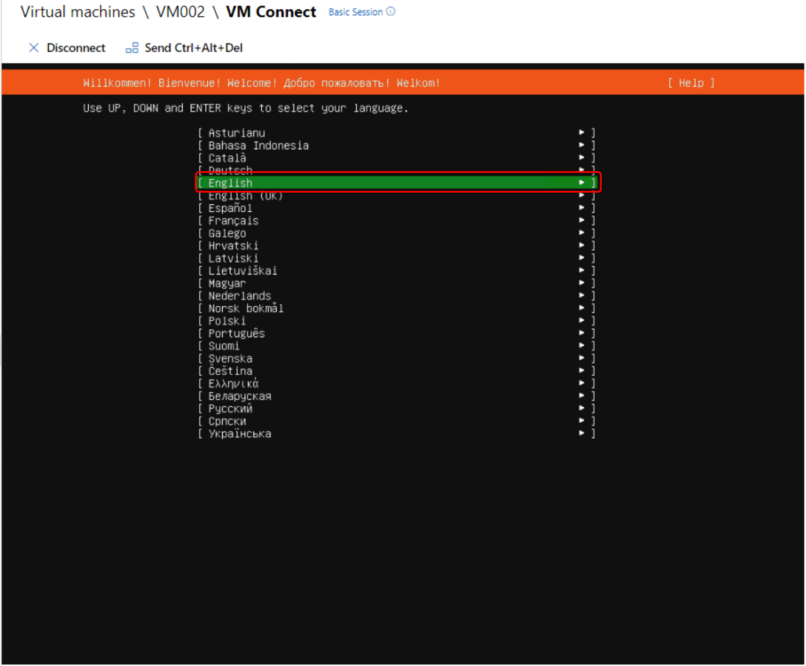 

1. On the "Keyboard configuration" page, select **Done** and ENTER

    

1. On the "Choose type of install" page, select **Done** and ENTER

    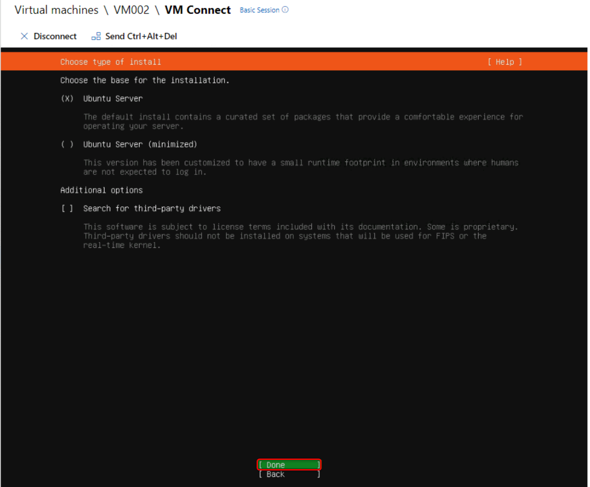 

2. On the "Network connections" page, select **Done** and ENTER
   
   **NOTE:** Make sure you see an IP on the DHCPv4 line!

     

3. On the "Configure Proxy" page, select **Done** and ENTER

    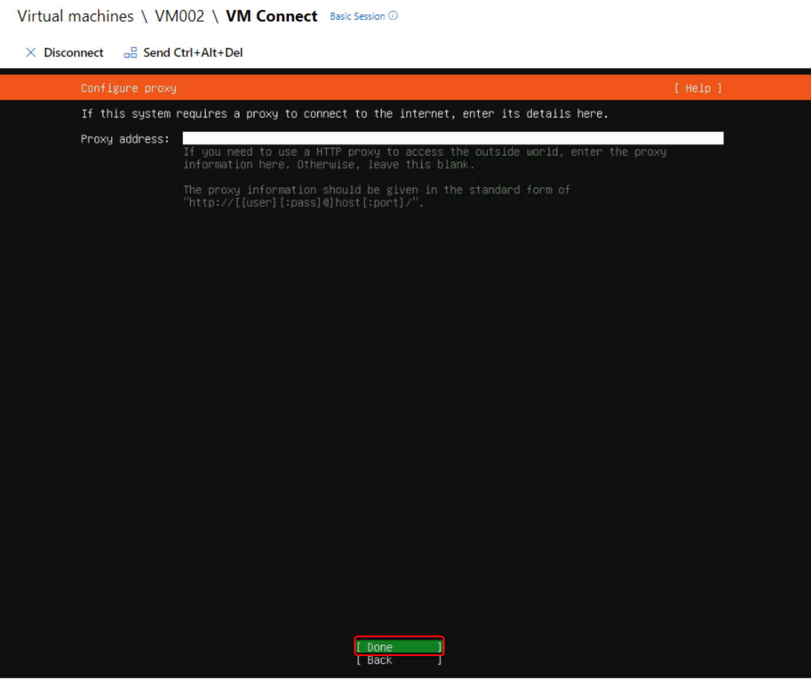

3. On the "Configure Ubuntu archive mirror" page, select **Done** and ENTER

    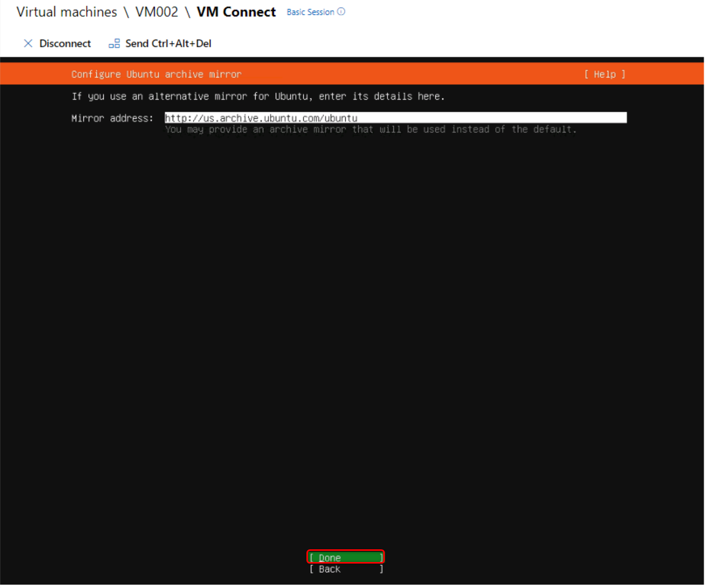 

7. On the "Guided storage configuration" page, select **Done** and ENTER

    

8.  On the storage configuration screen, select **Done** and then Select **Continue** to confirm the destructive action popup screen.

    

9.  On the Profile setup screen complete the fields a below and then select **Done** and ENTER
     * Your name: arcdemo
     * Your server's name: vm002
     * Pick a username: arcdemo
     * Choose a password: ArcPassword123!!
     * Confirm your password: ArcPassword123!!

    

10. On the "Upgrade to Ubuntu Pro" screen, select **Continue** and ENTER

    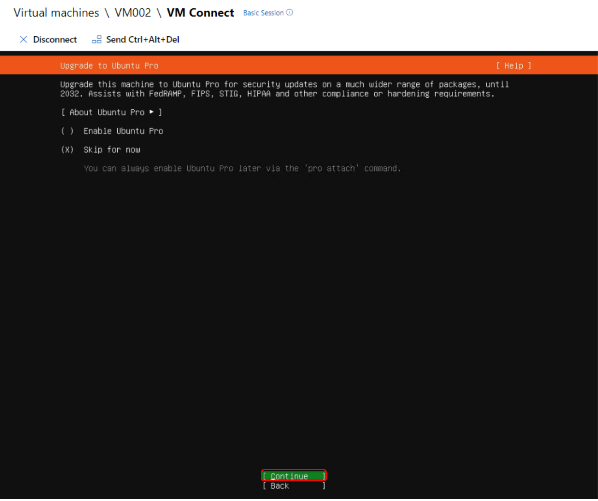

11. On the "SSH setup" screen, select "Install openSSH server" and select **Done**

    

12. On the "Featured Server snaps" screen, select **Done**

    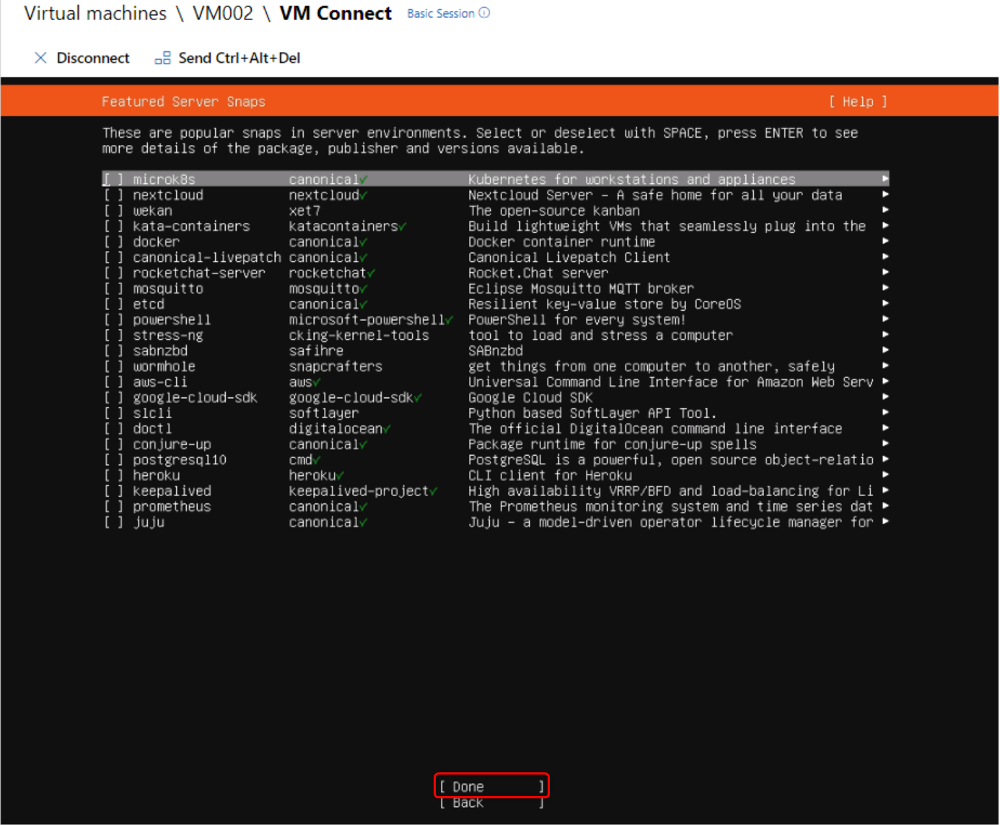

13. Now wait until you get the Install complete! screen and select "Reboot Now"

**BART ROELS**

    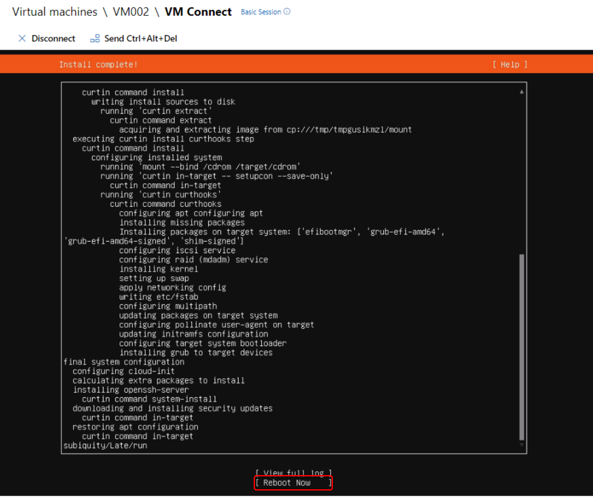

14. On the following screen press "ENTER", now the virtual machine will reboot.

    

15. Once the virtual machine is up and running try to login!

    

Task 5: Live migrate a virtual machine to another node
----- 

The final step we'll cover is using Windows Admin Center to live migrate VM001 from it's current node, to an alternate node in the cluster.

1. Still within the **Windows Admin Center** on **HybridHost001**, under **Compute**, click on **Virtual machines**

2. On the **Virtual machines** page, select the **Inventory** tab

3. Under **Host server**, make a note of the node that VM001 is currently running on.  You may need to expand the column width to see the name

4. Next to **VM001**, click the tick box next to VM001, then click **More**.  You'll notice you can Clone, Domain Join and also Move the VM. Click **Move**

You've successfully create a VM using the Windows Admin Center!

Congratulations!
-----------
You've reached the end of the evaluation guide.  In this guide you have:

* Deployed/Configured a Windows Server 2019 Hyper-V host in Azure to run your nested sandbox environment
* Deployed the AKS on Azure Stack HCI management cluster on your Windows Server 2019 Hyper-V environment
* Deployed a target cluster to run applications and services
* Optionally integrated with Azure Arc and deployed a sample application
* Set the foundation for further learning!

Great work!

Setup the lab in your own Azure Subscription.
-------------

This lab is based on the the following work by Matt McSpirit: https://github.com/mattmcspirit/hybridworkshop

If you want to setup the lab within your own Azure subscription and run through additional scenarios as well, you can go to the above GitHub repo and perform as mentioned.
