HOL-4: Exercise 2: Azure Stack HCI 22H2 Hybrid by design
==============
Overview
-----------
Discover, monitor, and manage the Azure Stack HCI hosts as well as the virtual machines. Extend your business to the cloud with an Azure hybrid solution. In this exercise you can now begin to explore the Hybrid by design capabilities of Azure Stack HCI 22H2 and Azure. We'll cover a few recommended activities below, to expose you to some of the key elements of Azure Stack HCI Hybrid by design capabilities.

Contents
-----------
- [HOL-4: Exercise 2: Azure Stack HCI 22H2 Hybrid by design](#hol-4-exercise-2-azure-stack-hci-22h2-hybrid-by-design)
  - [Overview](#overview)
  - [Contents](#contents)
  - [Task 1: Enable some Hybrid capabilities in Azure of your Azure Stack HCI cluster](#task-1-enable-some-hybrid-capabilities-in-azure-of-your-azure-stack-hci-cluster)
    - [Review the status of the Azure Arc required services in Windows Admin Center](#review-the-status-of-the-azure-arc-required-services-in-windows-admin-center)
  - [Task 2: Explore Azure Stack HCI Hybrid features in the Azure Portal](#task-2-explore-azure-stack-hci-hybrid-features-in-the-azure-portal)
    - [Explore Extensions](#explore-extensions)
    - [Manage Azure Stack HCI clusters using Windows Admin Center in Azure](#manage-azure-stack-hci-clusters-using-windows-admin-center-in-azure)
  - [Upload the .ISO files](#upload-the-iso-files)
    - [Upload the .Iso files to your CSV](#upload-the-iso-files-to-your-csv)
  - [Task 3: Deploy a Windows Server 2022 virtual machine](#task-3-deploy-a-windows-server-2022-virtual-machine)
  - [Task 4: Deploy an Ubuntu Server 22.04 virtual machine](#task-4-deploy-an-ubuntu-server-2204-virtual-machine)
  - [Task 5: Live migrate a virtual machine to another node](#task-5-live-migrate-a-virtual-machine-to-another-node)
  - [Summary](#summary)
  - [Product improvements](#product-improvements)
  - [Raising issues](#raising-issues)

Task 1: Enable some Hybrid capabilities in Azure of your Azure Stack HCI cluster
-----------
In this step, you will review the status of the Azure Arc services on the Azure Stack HCI 22H2 cluster by using Windows Admin Center, enable Hybrid Azure Stack HCI Cluster features in the Azure Portal.

### Review the status of the Azure Arc required services in Windows Admin Center ###

1. Open **Windows Admin Center** on the **AdminCenter** VM. On the top left click on **All connections** and click on your previously deployed cluster, **hciboxcluster.jumpstart.local**

    
    
        
2. On the left hand navigation, under **Configuration** select **Azure Arc**.  The central **Azure Arc** page, click **1. Azure Stack HCI registration**.

    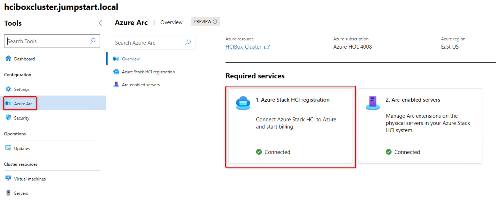
    
3. On the **Azure Stack HCI registration** page, you should see ...
   
    #### Azure Stack HCI system status: ####
   - **Connected** under the Azure connection status
   - **Registered** under the Azure Registration
    
    #### Server status: ####
   - **Connected** under the Azure connection status for every Server.       

    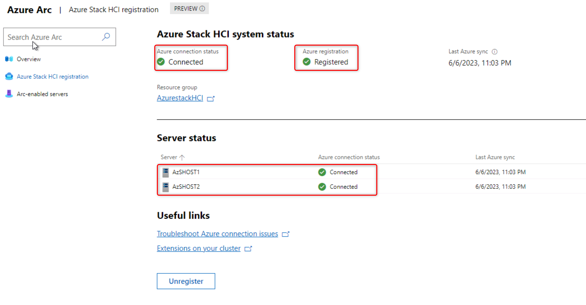
    
4. Now click **Arc-enabled servers** on the current **Azure Arc | Azure Stack HCI registration** page
  
    
  
5. On the **Azure Arc | Arc-enabled servers** page, click on **hciboxcluster-rg**. 
    
    

6. The Azure Portal will open in an extra browser Tab, showing you the **hciboxcluster-rg** resource group content. On the **Resources** page in the Azure Portal, click on the **hciboxcluster**.

    *You potentially will be asked to provide the Azure credentials. You can find them in the Environment Details of this Lab.*

    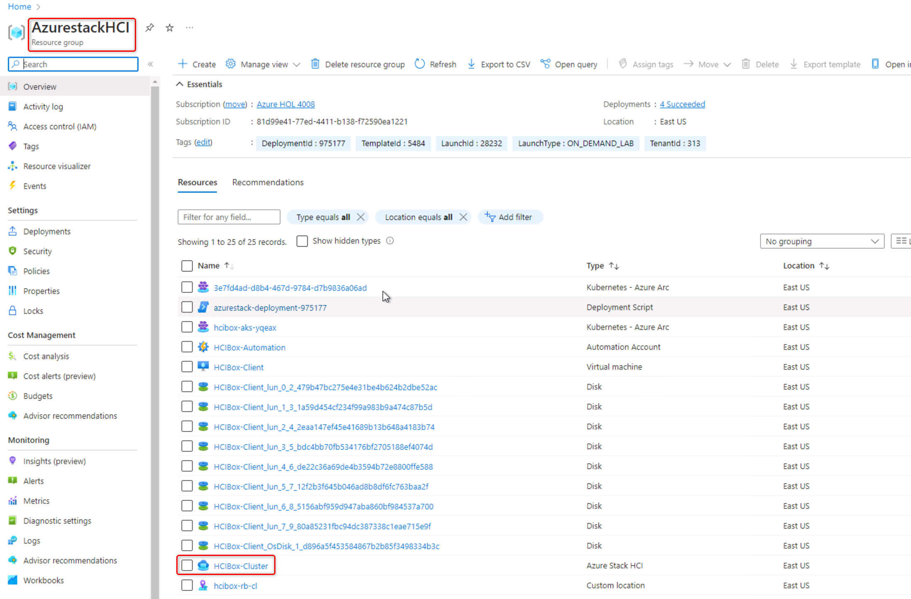

7. The Azure Portal will open the hciboxcluster - Azure Stack HCI blade. Click **Capabilities** and

    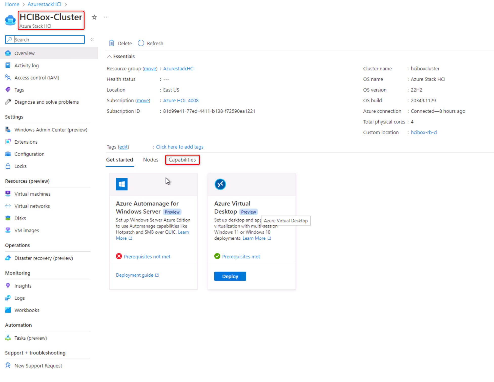

8. On the **Capabilities** tab, click **Logs**

    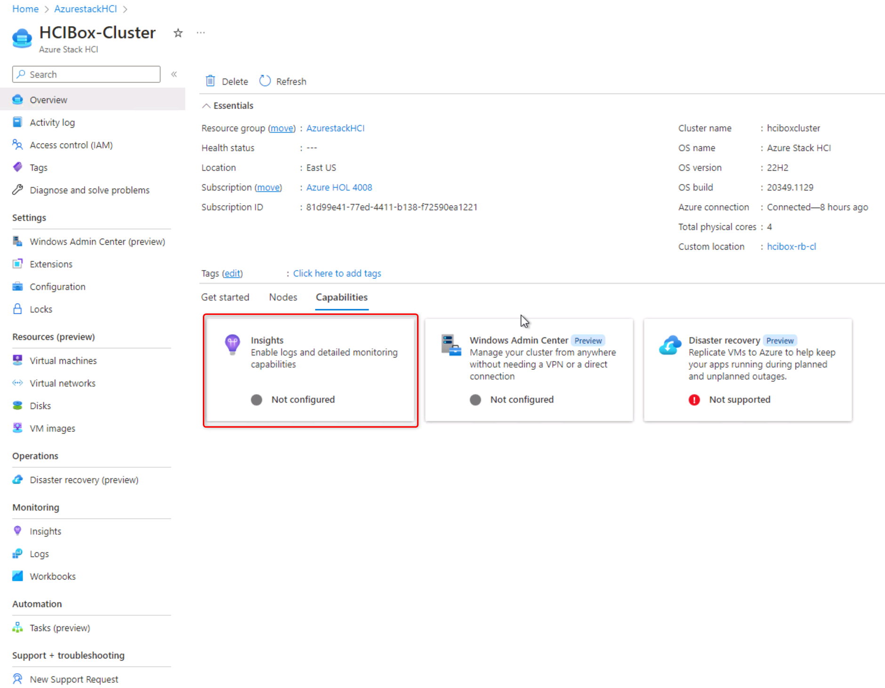    

9. On the **Configure extension: MicrosoftMonitoringAgent** page, click **Add**.

    **NOTE** *All existing Log Analytics Workplace fields should be pre-filled automatically*.
    
    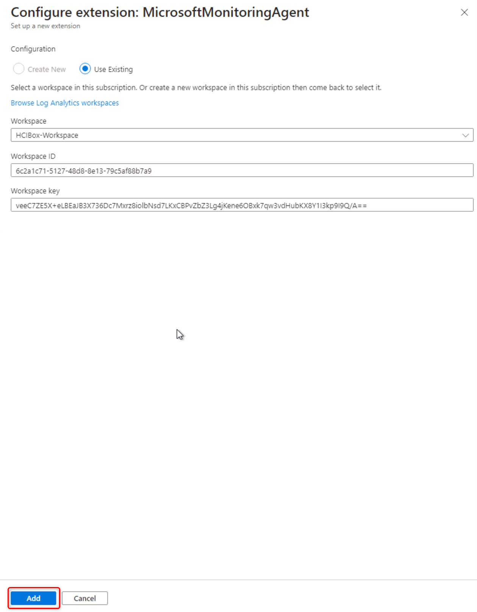

10. On the **Capabilities** tab, click **Insights**

    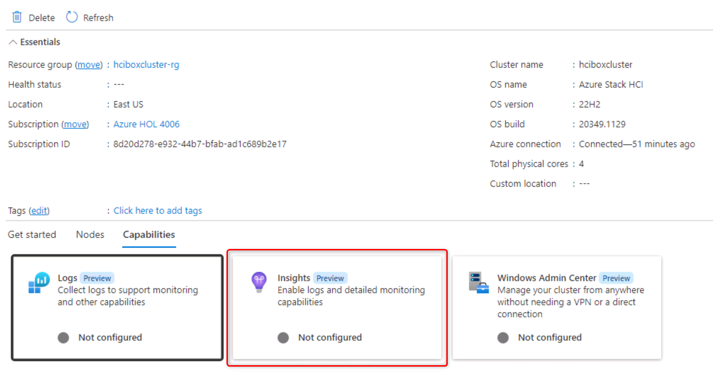    

11. On the **Azure Insights** page, click **Turn On**.
    
    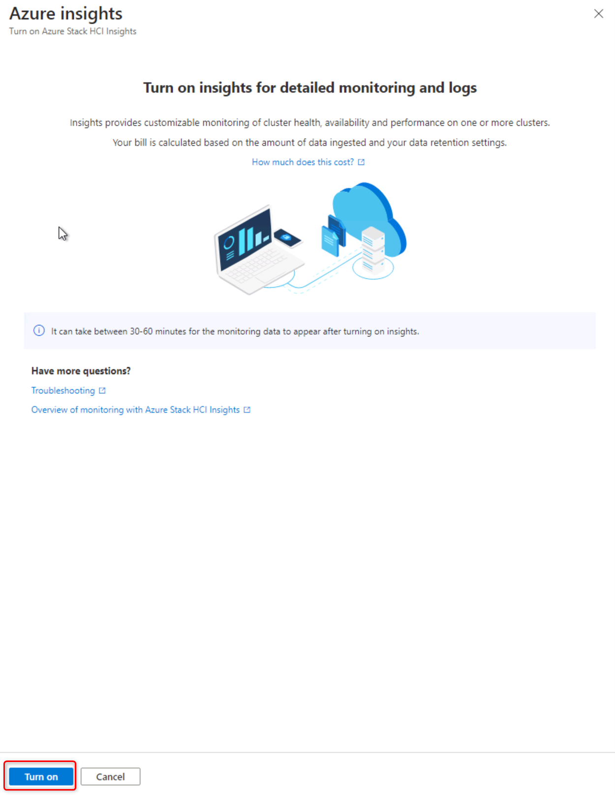

12. On the **Capabilities** tab, click **Windows Admin Center**

        

13. On the **Windows Admin Center (preview)** page, click **Set up**.
  
    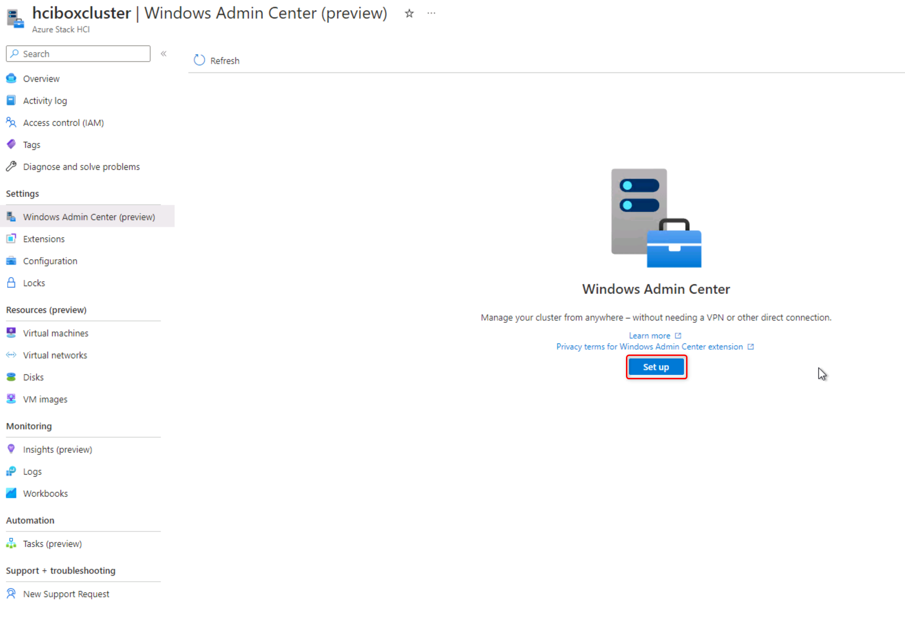

14. On the **Windows Admin Center** page, click **Set up**.
  
    

15. On the **Capabilities** tab, all 3 boxes should indicate **Configured**.

    **NOTE** This can take a couple of minutes, please be patient.
  
          

You just finalized the Activation of a couple of Hybrid features of Azure Stack HCI. Please proceed to the next Task.

Task 2: Explore Azure Stack HCI Hybrid features in the Azure Portal
-----------
In this step, you will further explore extra Azure Stack HCI Hybrid features and capabilities.

At this time you should still be having the following page active in the Azure Portal. If so Click **Extensions**.

     

### Explore Extensions ###

1. On the **Extension** page, you see that both Azure Stack HCI Cluster nodes have the **Microsoft Monitoring Agent** and the **(Windows) Admin Center agent** installed. This was enabled by the steps we took in Task 1.

    

2. Let us now first look at the Windows Admin Center Azure Portal Integration for Azure Stack HCI. Under Settings, Click Windows Admin Center.
   
   On the Windows Admin Center page, you will see a message, that you must be part of the Windows Admin Center Administrator Login group to be able to connect.

    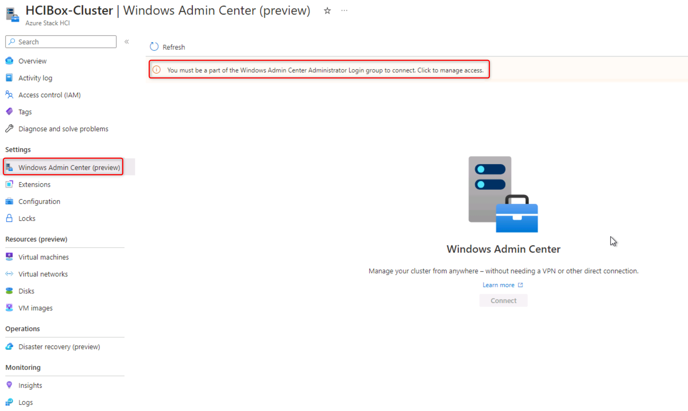

### Manage Azure Stack HCI clusters using Windows Admin Center in Azure  ### 

First we need to make sure that all requirements are met for using Windows Admin Center in the Azure portal to manage a hybrid machine

1. In the **"Search resources, services, and docs"** search box at the top of the Azure Portal page, type **subscription** and under **Services**, click **Subscriptions**.

    
 
2. On the **Subscriptions** page, click on the Subscription name.

    

3. On the selected **Subscription** page, click **Resource providers**

        

4. On the **Resource providers** page, type **hybrid** in the filter by name box. Make sure the status of the Provider **Microsoft.HybridConnectivity** is **Registered**. If not Register if now.

    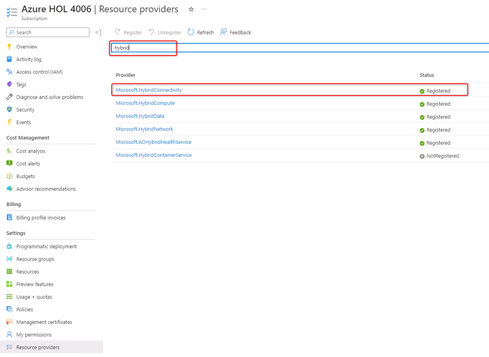

5. On the current page, Click **Access Control (IAM)**. 

    

6. On the **Access controle (IAM)** page, Click **+ Add** and **Add role assignment**.

    

7. On the **Add role assignment** page, under the **Role** tab, search for **Windows Admin Center Administrator Login**. Click on the role name **Windows Admin Center Administrator Login**. Click **Members**.

    

8. On the **Add role assignment** page, under the **Members** tab, Click **"+Select members**. Click on your Azure User. Click **Select** and then Click **Next**.

        

9. On the **Add role assignment** page, under the **Review + assign** tab, Click **Review + assign** at the bottom of the page.

    **NOTE** We have just the **Windows Admin Center Administrator Login** Role to an AAD User on the Subscription scope. Learn more : https://learn.microsoft.com/en-us/windows-server/manage/windows-admin-center/azure/manage-hci-clusters

   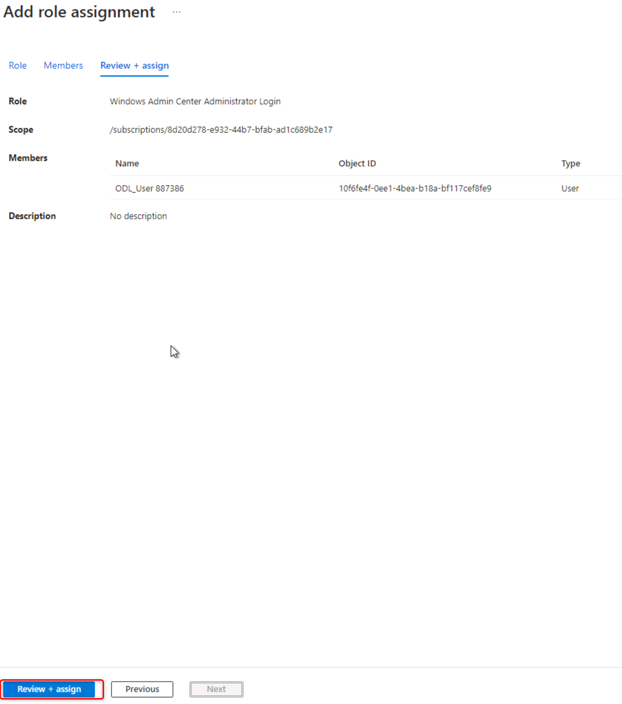

10. In the **"Search resources, services, and docs"** search box at the top of the Azure Portal page, type **hciboxcluster** and under **Resources**, click **hciboxcluster**.

   

11. On the **hciboxcluster** page, under Settings, click **Windows Admin Center** and then Click **Connect**.

   

12. On the **Windows Admin Center** page, complete the Username and Password field and Click Sign In.

**Note** Make sure the use the fully-qualified-DNS-domain\username format, and not the user principal name (UPN) format (user@fully_qualified_DNS_domain_name).

   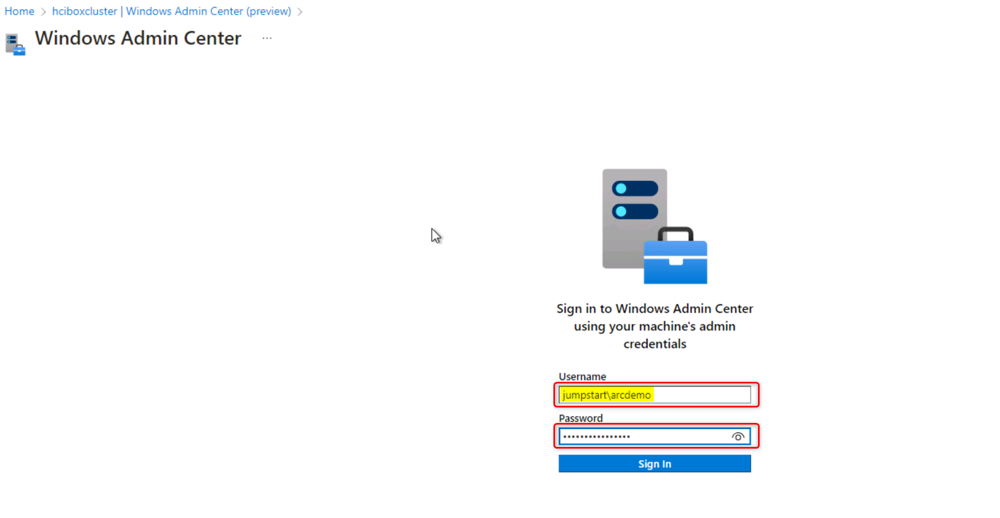

If all how well you should now have a Windows Admin Center view on your Azure Stack HCI cluster, without needing a VPN or other direct connections. Feel free to look around.

   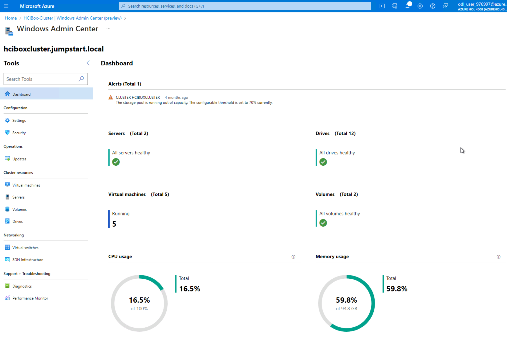

## Upload the .ISO files ##
### Upload the .Iso files to your CSV ###
 
1. Open **Windows Admin Center** on **AdminCenter** VM from the desktop if it is not already opened, click on your previously deployed cluster, **hciboxcluster.jumpstart.local**
 
    
 
2. On the left hand navigation, under **Cluster Resources** select **Servers** and then **Inventory**.
 
    

3. Select node AzSHOST1 and then click **Manage**
 
    
 
4. On the left, select **Files & file sharing**. Open the folder **C:\ClusterStorage\S2D_vDISK1**
  
    
 
5. Click **Upload**. Click **Select Files**, search and select both (Windows Server 2022 and Ubuntu Server 22.04) .iso files in the Downloads directory and click **Open**, and then click **Submit**. 
 
    
  
**NOTE:** It can take up to around 5-10 minutes to get both .ISO files successfully uploaded. Maybe a good time to grab a coffee ;-). Once both .ISO files are successfully uploaded you can move on to the next Task.

Task 3: Deploy a Windows Server 2022 virtual machine
----- 
In this step, you will deploy a Windows Server 2022 virtual machine via Windows Admin Center.

1. Once logged into the **Windows Admin Center** on the **AdminCenter** VM, click on your previously deployed cluster, **hciboxcluster.jumpstart.local**

2. On the left hand navigation, under **Cluster Resources** select **Virtual machines**.  The central **Virtual machines** page shows that there are some virtual machines already running.
    
    

3. On the **Virtual machines** page, select the **Inventory** tab, and then click on **Add** and select **New**.

    

4. In the **New virtual machine** pane, enter **VM001** for the name, and enter the following pieces of information, then click **Create**
 
     * Generation: **Generation 2 (Recommended)**
     * Host: **Leave as recommended**
     * Path: **C:\ClusterStorage\S2D_vDISK1**
     * Virtual processors: **2**
     * Startup memory (GB): **4**
     * Use dynamic memory: **Min 2, Max 6**
     * Network: **sdnSwitch**
     * Storage: **Add, then Create an empty virtual hard disk** and set size to **30GB**
     * Operating System: Install an operating system from an image file (.iso). Select the Windows Server 2022 Iso file!

    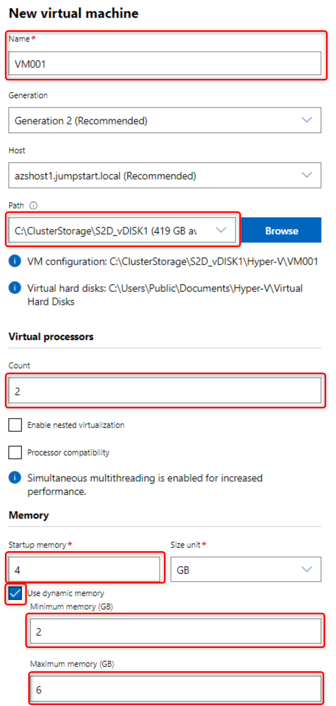
      
    
 
5. The creation process will take a few moments, and once complete, VM001 should show within the Virtual machines view

6. Click on the checkbox before VM001 and then click on **Power** and select **Start** - within moments, the VM should be running.

    
    
  
7. Click on VM001 to view the properties and status for this running VM.
 
    

8. Click on **Settings**, then click **Networks** and change the VLAN ID value to **200**. Click **Save network settings and click **Close**.
 
    

9. Click on Connect and select connect button from the drop down.

    
 
10. Fill in the Username **arcdemo@jumpstart.local** and password **ArcPassword123!!**. Before clicking on **Connect** first make sure to click the checkbox before "Automatically connect with the certificate presented by this machine", when you receive the certificate prompt, click **Confirm**. Now click **Connect**.
  
    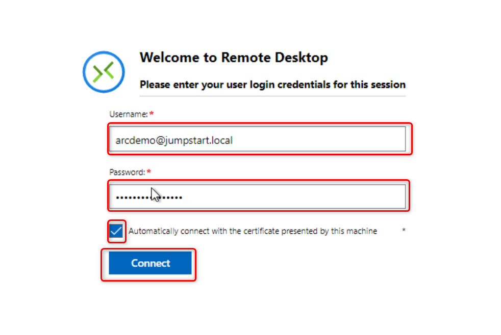 
 
11. The VM will be in the UEFI boot summary as below
 
    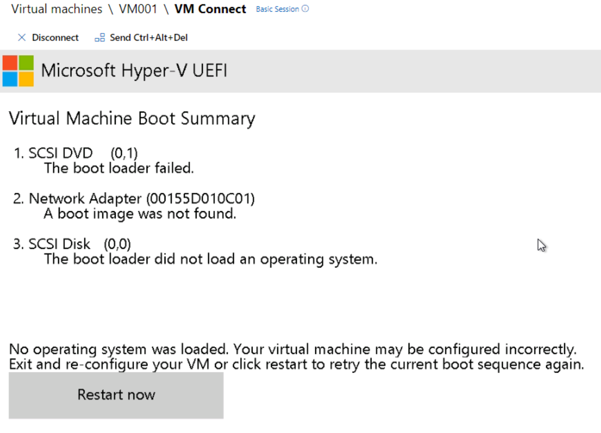 
 
12. Click in "Send Ctrl + Alt + Del" at the top of the page now and press any key when you see the message "Press any key at boot from CD or DVD…"
 
    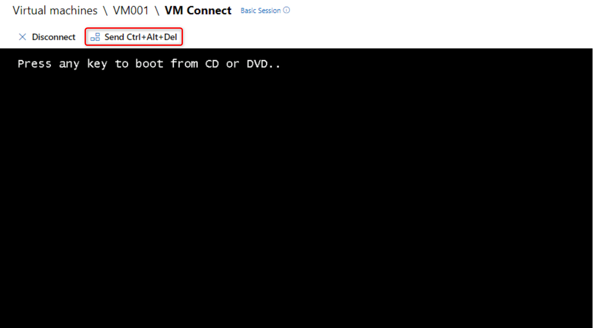 
 
13. From there you'll start the OOBE experience. Select the following settings according to your preferences: Language, Time currency and Keyboard. Click **Next**

14. Click Install Now, and select the version Windows Server 2022 Standard Evaluation (Desktop Experience). Click **Next**
 
     
 
15. Accept the license terms. Click **Next**. Select "Custom: Install Windows only (advanced)" and then Next. It will take around 10 minutes for the VM to boot. After that, please insert the lab credentials **ArcPassword123!!** and your VM is ready to go!

16. Once the virtual machine is up and running try to login!

**NOTE:** You will notice that the VM did not received a proper IPv4 address from the DHCP server. If you want to fix this you can open the VM001 settings page and under Networking you can change the VLAN ID from 2 to 200. 

 

If everything went well your Windows Server should now receive a proper IPv4 Address.

You just finalized the installation of a new Window Server 2022 VM on your Azure Stack HCI Cluster. Please proceed to the next Task.

Task 4: Deploy an Ubuntu Server 22.04 virtual machine
----- 
In this step, you will deploy an Ubuntu Server 22.04 virtual machine via Windows Admin Center.

1. Once logged into the **Windows Admin Center** on the **AdminCenter** VM, click on cluster, **hciboxcluster.jumpstart.local**

2. On the left hand navigation, under **Cluster Resources** select **Virtual machines**.  The central **Virtual machines** page shows that there are some virtual machines already running.
    
    

3. On the **Virtual machines** page, select the **Inventory** tab, and then click on **Add** and select **New**.

    

4. In the **New virtual machine** pane, enter **VM002** for the name, and enter the following pieces of information, then click **Create**

 
     * Generation: **Generation 2 (Recommended)**
     * Host: **Leave as recommended**
     * Path: **C:\ClusterStorage\S2D_vDISK1**
     * Virtual processors: **1**
     * Startup memory (GB): **2**     
     * Network: **sdnSwitch**
     * Storage: **Add, then Create an empty virtual hard disk** and set size to **20GB**
     * Operating System: Install an operating system from an image file (.iso). Select the Ubuntu Server 22.04 Iso file!

    
      
    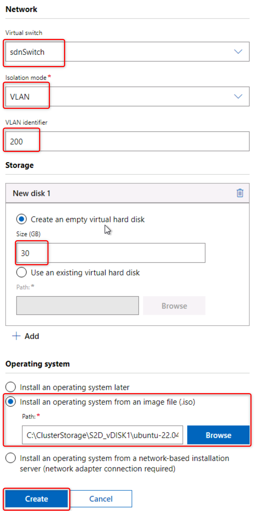
 
 
5. The creation process will take a few moments, and once complete, VM002 should show within the Virtual machines view

1. Click on the VM name **VM002** and then Click on **Settings** to view all VM properties. Click on **Security**
 
    

1. Make sure to change the Secure Boot template to "Microsoft UEFI Certificate Authority" in the Template drop down box, and click **save security settings**. DO NOT CLICK **Close**.

    

1. Click **Networks** in the left menu under "Settings for VM002" and make sure to change the VLAN identifier to **200** and click **save Networks settings**. Click Close.

    

6. Click on **Power** and select **Start** - within moments, the VM should be running.

    
    
  
7. View the properties and status for this running VM.
 
    
    

8. Click on Connect and select connect button from the drop down.

    
 
9.  Fill in the Username **arcdemo@jumpstart.local** and password **ArcPassword123!!**. Before clicking on **Connect** first make sure to click the checkbox before "Automatically connect with the certificate presented by this machine", when you receive the certificate prompt, click **Confirm**. Now click **Connect**.
  
     
 

1. Once the integrity check is done you will be able to select your language. Select **English**.

     

1. On the "Keyboard configuration" page, select **Done** and ENTER

    

1. On the "Choose type of install" page, select **Done** and ENTER

     

2. On the "Network connections" page, select **Done** and ENTER
   
   **NOTE:** Make sure you see an IP on the DHCPv4 line!

     

3. On the "Configure Proxy" page, select **Done** and ENTER

    

3. On the "Configure Ubuntu archive mirror" page, select **Done** and ENTER

     

7. On the "Guided storage configuration" page, select **Done** and ENTER

    

8.  On the storage configuration screen, select **Done** and then Select **Continue** to confirm the destructive action popup screen.

    

9.  On the Profile setup screen complete the fields a below and then select **Done** and ENTER
     * Your name: arcdemo
     * Your server's name: vm002
     * Pick a username: arcdemo
     * Choose a password: ArcPassword123!!
     * Confirm your password: ArcPassword123!!

    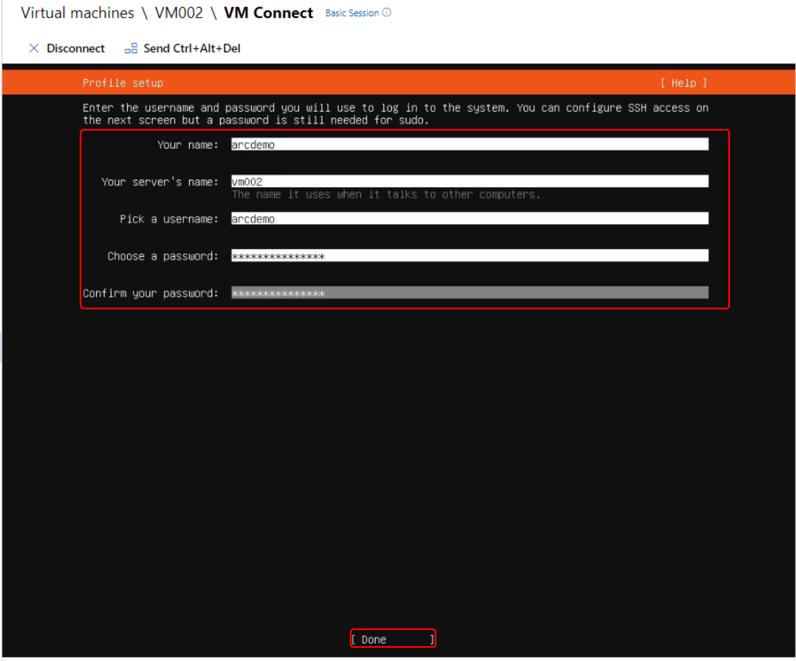

10. On the "Upgrade to Ubuntu Pro" screen, select **Continue** and ENTER

    

11. On the "SSH setup" screen, select "Install openSSH server" and select **Done**

    

12. On the "Featured Server snaps" screen, select **Done**

    

13. Now wait until you get the "Install complete!" screen and select **Reboot Now** and ENTER

15. Once the virtual machine is up and running try to login!

Task 5: Live migrate a virtual machine to another node
----- 

The final step we'll cover is using Windows Admin Center to live migrate VM002 from it's current node, to an alternate node in the cluster.

1. Still within the **Windows Admin Center** on **AdminCenter** VM, under **Cluster Resources**, click on **Virtual machines**

2. On the **Virtual machines** page, select the **Inventory** tab

3. Under **Host server**, make a note of the node that VM002 is currently running on.  You may need to expand the column width to see the name

    

4. Next to **VM002**, click the tick box next to VM002, then click **More**.  You'll notice you can Clone, Domain Join and also Move the VM. Click **Move**

    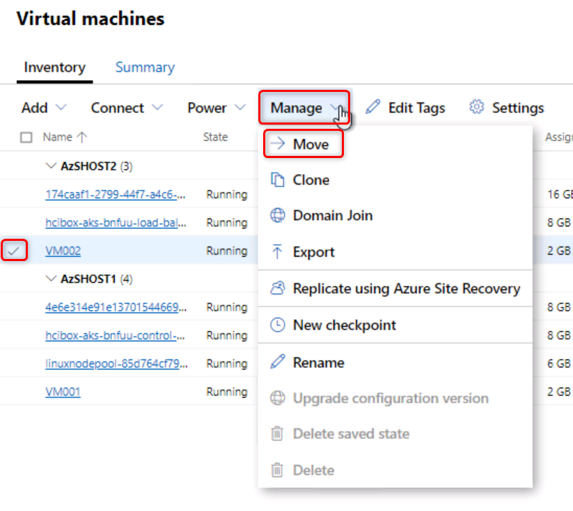

5. Next to **VM002**, click the tick box next to VM002, then click **More**.  You'll notice you can Clone, Domain Join and also Move the VM. Click **Move**    

    

    

You've successfully moved a running VM without downtime using the Windows Admin Center to another Host in the Azure Stack HCI cluster!

Summary
-----------
In this exercise, you have been exploring the existing Cluster Shared Volume which was created for you on Azure Stack HCI cluster. You also looked at more details and options related to the Volumes you can create in Azure Stack HCI. In Task 2 you downloaded some ISO files which you have used in Task 3 and Task 4 to respectively deployed a Windows Server 2022 VM and an Ubuntu 22.04 VM on the Azure Stack HCI Cluster. You finished this exercise by testing a Live migration of the Linux based VM to another available Azure Stack HCI Cluster node.

With this completed, you can now move on to the next exercise.

Product improvements
-----------
If, while you work through this guide, you have an idea to make the product better, whether it's something in Azure Stack HCI, AKS on Azure Stack HCI, Windows Admin Center, or the Azure Arc integration and experience, let us know! We want to hear from you!

For **Azure Stack HCI**, [Head on over to the Azure Stack HCI Q&A forum](https://learn.microsoft.com/en-us/answers/tags/6/azure-stack-hci "Azure Stack HCI Q&A"), where you can share your thoughts and ideas about making the technologies better and raise an issue if you're having trouble with the technology.

For **AKS on Azure Stack HCI**, [Head on over to our AKS on Azure Stack HCI GitHub page](https://github.com/Azure/aks-hci/issues "AKS on Azure Stack HCI GitHub"), where you can share your thoughts and ideas about making the technologies better. If however, you have an issue that you'd like some help with, read on... 

Raising issues
-----------
This lab is based on the Azure Arc Jumpstart HCIBox: https://azurearcjumpstart.io/azure_jumpstart_hcibox/

If you want to setup the lab within your own Azure subscription please follow this link : https://azurearcjumpstart.io/azure_jumpstart_hcibox/#deployment-options-and-automation-flow

If you notice something is wrong with this guide, such as a step isn't working, or something just doesn't make sense - help us to make this guide better!
