HOL-4: Exercise 2: Azure Stack HCI 22H2 Hybrid by design
==============
Overview
-----------
Discover, monitor, and manage the Azure Stack HCI hosts as well as the virtual machines. Extend your business to the cloud with an Azure hybrid solution. In this exercise you can now begin to explore the Hybrid by design capabilities of Azure Stack HCI 22H2 and Azure. We'll cover a few recommended activities below, to expose you to some of the key elements of Azure Stack HCI Hybrid by design capabilities.

Contents
-----------
- [HOL-4: Exercise 2: Azure Stack HCI 22H2 Hybrid by design](#hol-4-exercise-2-azure-stack-hci-22h2-hybrid-by-design)
  - [Overview](#overview)
  - [Contents](#contents)
  - [Task 1: Enable some Hybrid capabilities in Azure of your Azure Stack HCI cluster](#task-1-enable-some-hybrid-capabilities-in-azure-of-your-azure-stack-hci-cluster)
    - [Review the status of the Azure Arc required services in Windows Admin Center](#review-the-status-of-the-azure-arc-required-services-in-windows-admin-center)
  - [Task 2: Manage Azure Stack HCI clusters using Windows Admin Center in Azure](#task-2-manage-azure-stack-hci-clusters-using-windows-admin-center-in-azure)
    - [Enable all requirements so you can use Windows Admin Center in the Azure portal to manage a hybrid machine](#enable-all-requirements-so-you-can-use-windows-admin-center-in-the-azure-portal-to-manage-a-hybrid-machine)
  - [Task 3: Explore Azure Stack HCI Hybrid features in the Azure Portal](#task-3-explore-azure-stack-hci-hybrid-features-in-the-azure-portal)
    - [Explore Extensions](#explore-extensions)
    - [Configuration of The Azure Stack HCI 22H2 cluster in the Azure Portal](#configuration-of-the-azure-stack-hci-22h2-cluster-in-the-azure-portal)
    - [Monitor Insights on your Azure Stack HCI clusters using in Azure](#monitor-insights-on-your-azure-stack-hci-clusters-using-in-azure)
  - [Summary](#summary)
  - [Product improvements](#product-improvements)
  - [Raising issues](#raising-issues)

Task 1: Enable some Hybrid capabilities in Azure of your Azure Stack HCI cluster
-----------
In this step, you will review the status of the Azure Arc services on the Azure Stack HCI 22H2 cluster by using Windows Admin Center, enable Hybrid Azure Stack HCI Cluster features in the Azure Portal.

### Review the status of the Azure Arc required services in Windows Admin Center ###

1. Open **Windows Admin Center** on the **AdminCenter** VM. On the top left click on **All connections** and click on your previously deployed cluster, **hciboxcluster.jumpstart.local**

    
    
        
2. On the left hand navigation, under **Configuration** select **Azure Arc**.  The central **Azure Arc** page, click **1. Azure Stack HCI registration**.

    
    
3. On the **Azure Stack HCI registration** page, you should see ...
   
    #### Azure Stack HCI system status: ####
   - **Connected** under the Azure connection status
   - **Registered** under the Azure Registration
    
    #### Server status: ####
   - **Connected** under the Azure connection status for every Server.       

    
    
4. Now click **Arc-enabled servers** on the current **Azure Arc | Azure Stack HCI registration** page
  
    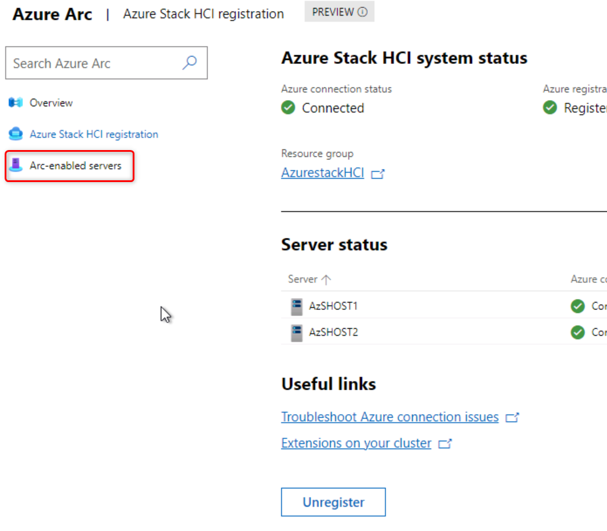
  
5. On the **Azure Arc | Arc-enabled servers** page, click on **hciboxcluster-rg**. 
    
    

6. The Azure Portal will open in an extra browser Tab, showing you the **hciboxcluster-rg** resource group content. On the **Resources** page in the Azure Portal, click on the **hciboxcluster**.

    *You potentially will be asked to provide the Azure credentials. You can find them in the Environment Details of this Lab.*

    

7. The Azure Portal will open the hciboxcluster - Azure Stack HCI blade. Click **Capabilities** and

    

8. On the **Capabilities** tab, click **Logs**

        

9. On the **Configure extension: MicrosoftMonitoringAgent** page, click **Add**.

    **NOTE** *All existing Log Analytics Workplace fields should be pre-filled automatically*.
    
    

10. On the **Capabilities** tab, click **Insights**

        

11. On the **Azure Insights** page, click **Turn On**.
    
    

12. On the **Capabilities** tab, click **Windows Admin Center**

    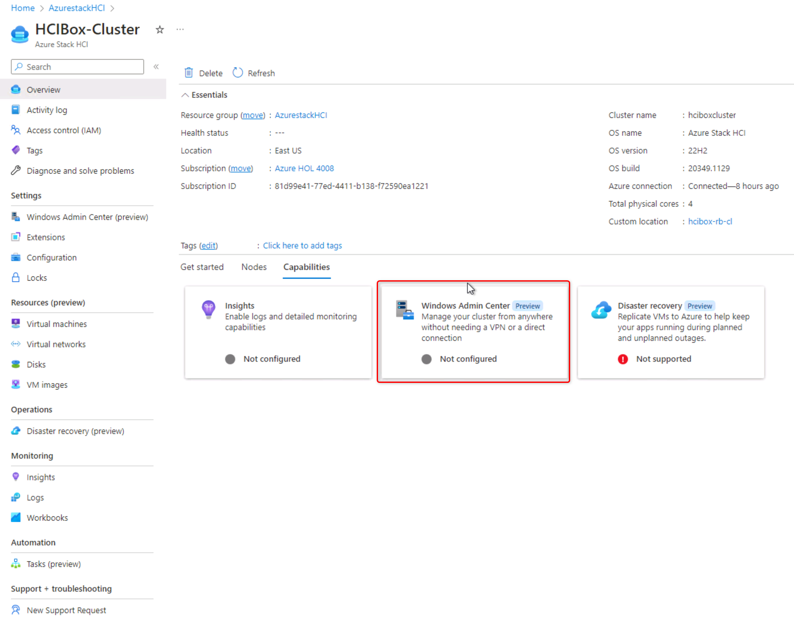    

13. On the **Windows Admin Center (preview)** page, click **Set up**.
  
    

14. On the **Windows Admin Center** page, click **Set up**.
  
    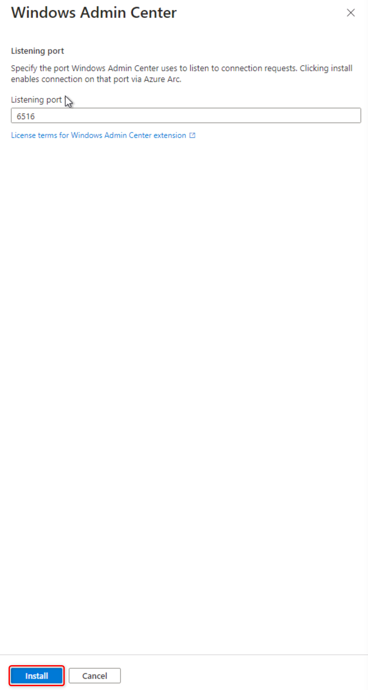

15. On the **Capabilities** tab, all 3 boxes should indicate **Configured**.

    **NOTE** This can take a couple of minutes, please be patient.
  
          

You just finalized the Activation of a couple of Hybrid features of Azure Stack HCI.
Once all 3 boxes show **Configured** proceed to the next Task.

Task 2: Manage Azure Stack HCI clusters using Windows Admin Center in Azure
-----------
In this step, you will prepare your Azure Stack HCI Cluster resource in Azure to be connect to it using Windows Admin Center from the Azure Portal.

### Enable all requirements so you can use Windows Admin Center in the Azure portal to manage a hybrid machine ###

1.  On the **hciboxcluster** page, under Settings, click **Windows Admin Center**.
   
    On the **Windows Admin Center** page, you will see a message, that you must be part of the Windows Admin Center Administrator Login group to be able to connect.

    

2. In the **"Search resources, services, and docs"** search box at the top of the Azure Portal page, type **subscription** and under **Services**, click **Subscriptions**.

    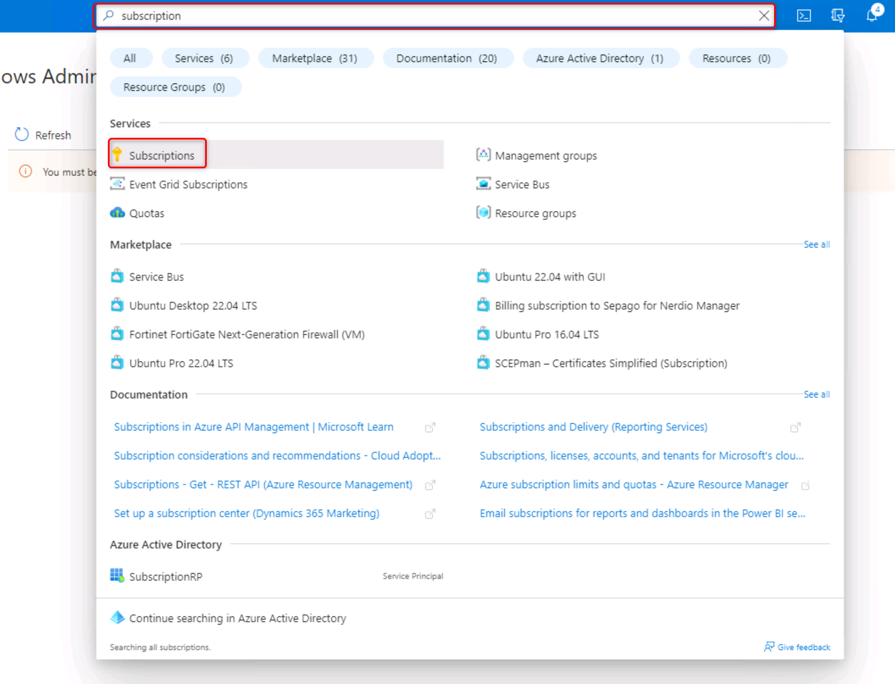
 
3. On the **Subscriptions** page, click on the Subscription name.

    

4. On the selected **Subscription** page, click **Resource providers**

    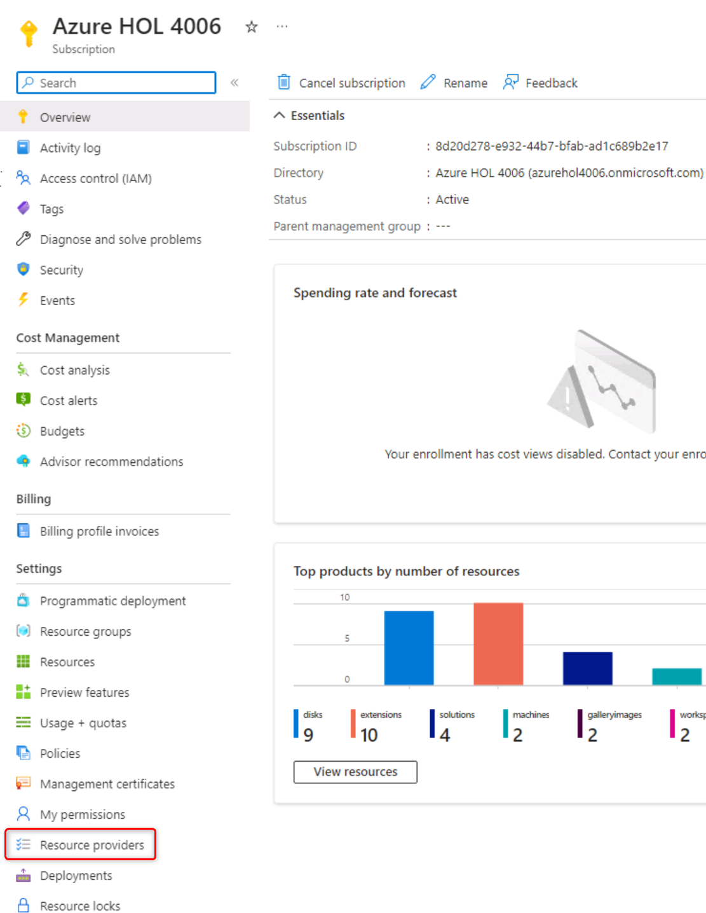    

5. On the **Resource providers** page, type **hybrid** in the filter by name box. Make sure the status of the Provider **Microsoft.HybridConnectivity** is **Registered**. If not Register if now.

    

6. On the current page, Click **Access Control (IAM)**. 

    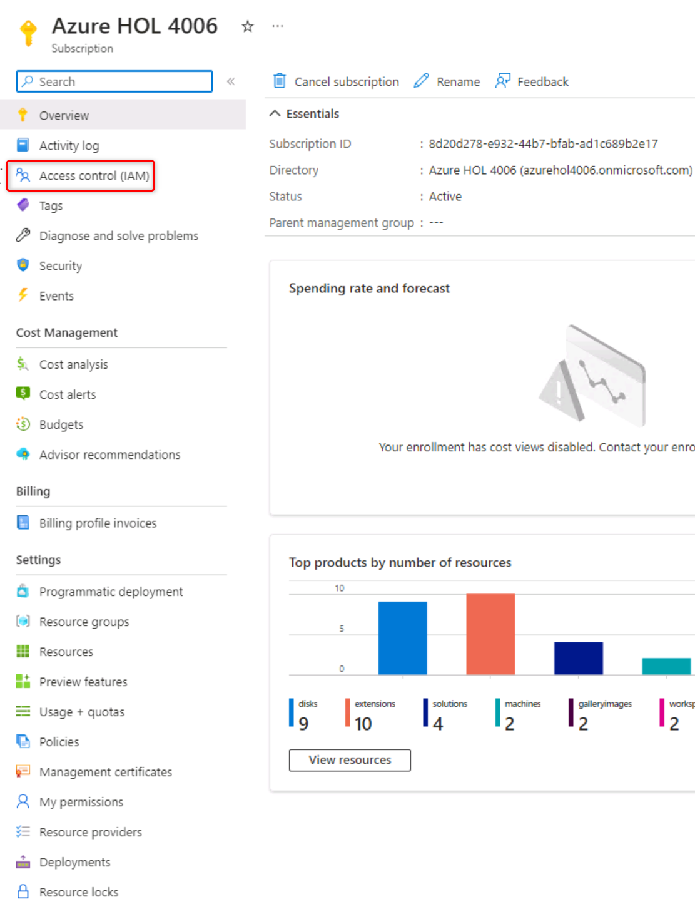

7. On the **Access controle (IAM)** page, Click **+ Add** and **Add role assignment**.

    

8. On the **Add role assignment** page, under the **Role** tab, search for **Windows Admin Center Administrator Login**. Click on the role name **Windows Admin Center Administrator Login**. Click **Members**.

    

9. On the **Add role assignment** page, under the **Members** tab, Click **"+Select members**. Click on your Azure User. Click **Select** and then Click **Next**.

    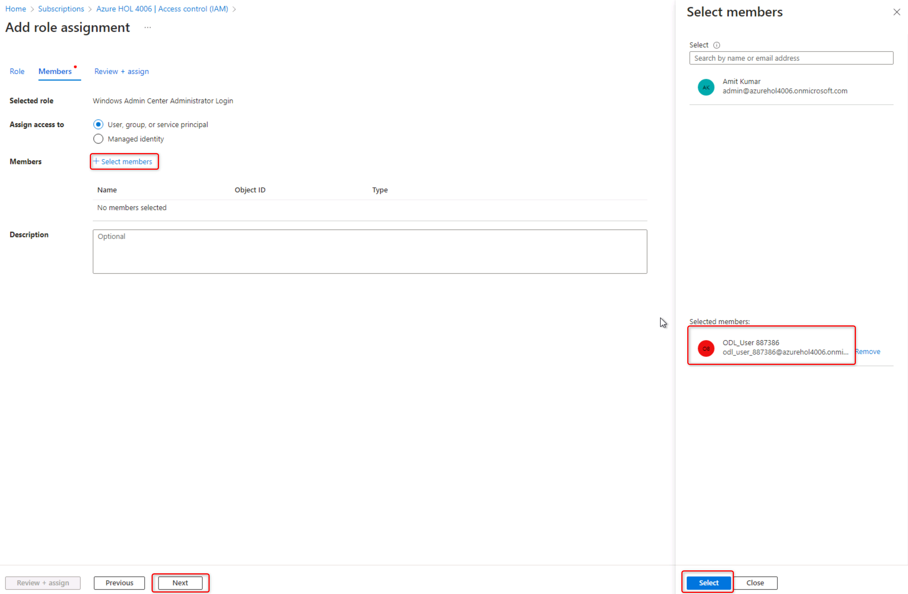    

10. On the **Add role assignment** page, under the **Review + assign** tab, Click **Review + assign** at the bottom of the page.

    **NOTE** We have just the **Windows Admin Center Administrator Login** Role to an AAD User on the Subscription scope. Learn more : https://learn.microsoft.com/en-us/windows-server/manage/windows-admin-center/azure/manage-hci-clusters

   

11. In the **"Search resources, services, and docs"** search box at the top of the Azure Portal page, type **hciboxcluster** and under **Resources**, click **hciboxcluster**.

   

12. On the **hciboxcluster** page, under Settings, click **Windows Admin Center** and then Click **Connect**.

   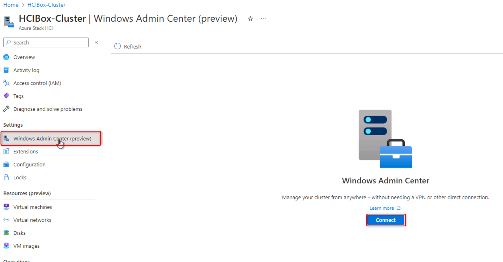

13. On the **Windows Admin Center** page, complete the Username and Password field and Click Sign In.

**Note** Make sure the use the fully-qualified-DNS-domain\username format, and not the user principal name (UPN) format (user@fully_qualified_DNS_domain_name).

   

If all how well you should now have a Windows Admin Center view on your Azure Stack HCI cluster, without needing a VPN or other direct connections. Feel free to look around.

   

Task 3: Explore Azure Stack HCI Hybrid features in the Azure Portal
-----------
In this step, you will further explore extra Azure Stack HCI Hybrid features and capabilities.

At this time you should still be having the following page active in the Azure Portal. If so Click **Extensions**.

     

### Explore Extensions ###

1. On the **Extension** page, you see that both Azure Stack HCI Cluster nodes have the **Microsoft Monitoring Agent** and the **(Windows) Admin Center agent** installed. This was enabled by the steps we took in Task 1.

    

### Configuration of The Azure Stack HCI 22H2 cluster in the Azure Portal ###

1. In the **"Search resources, services, and docs"** search box at the top of the Azure Portal page, type **hciboxcluster** and under **Resources**, click **hciboxcluster**.

   
      
2. On the **hciboxcluster** page, under Settings, click **Configuration**.

   

3. On the **Configuration** page, click **Configuration**. Here you find 5 different Configuration topics. The first part you find is the Summary of your **Billing** for your Azure Stack HCI System.

   - Notice that every Azure Stack HCI environment starts with a 60day Free Trial.
   - Here you also find the number of Physical Cores. Remember that you will only see the in the HW BIOS enabled Physical cores here. So you can optimize your cost by disabling unused physical core in your hardware BIOS.
  
     **Learn more on:** https://learn.microsoft.com/en-us/azure-stack/hci/concepts/billing

        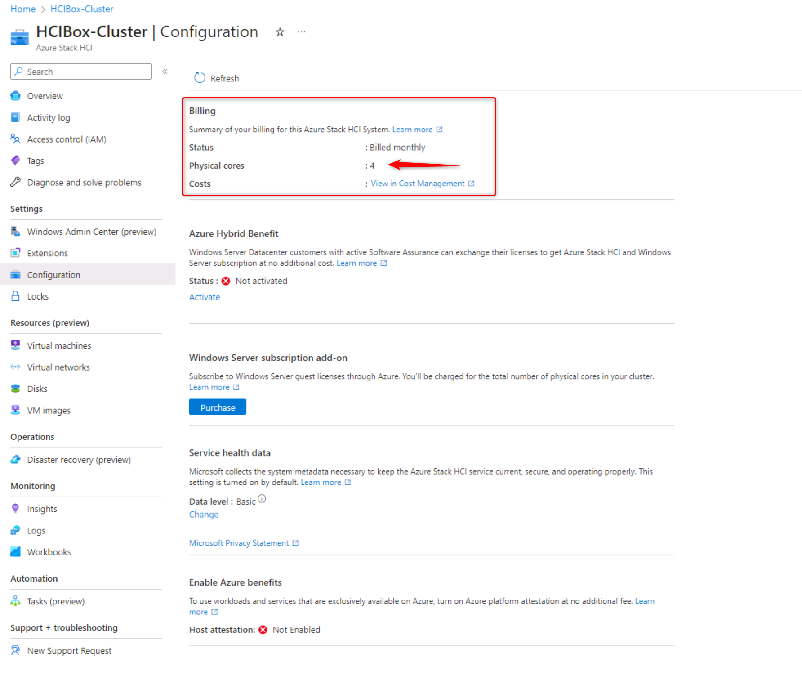

4. The 2nd part on the same **configuration** page is where you can activate your **Azure Hybrid Benefits**.
   
   To be eligible for the **Azure Hybrid Benefits** you need to have enough Windows Server Data Center licenses with Active Software Assurance. Those licenses can be exchanged to get Azure Stack HCI and Windows Server subscriptions at no additional cost.
 
     **Learn more on:** https://learn.microsoft.com/en-us/windows-server/get-started/azure-hybrid-benefit#getting-azure-hybrid-benefit-for-azure-stack-hci

     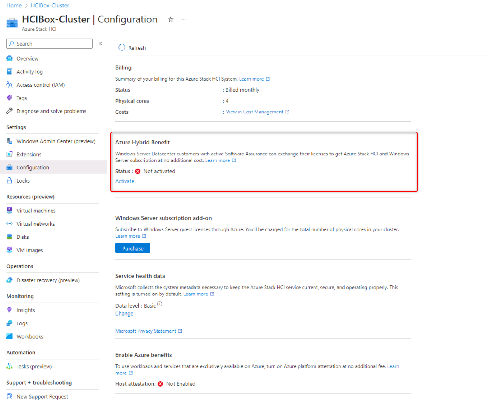        

5. The 3rd part on the **configuration** page is where you are able to purchase a **Windows Server subscription add-on**.
   
   Here you can buy subscription based Windows Server licenses to cover your guest Virtual machines running Windows Server. You will be charged for the total number of physical cores in your cluster
 
     **Learn more on:** https://learn.microsoft.com/en-us/azure-stack/hci/manage/vm-activate#windows-server-subscription

     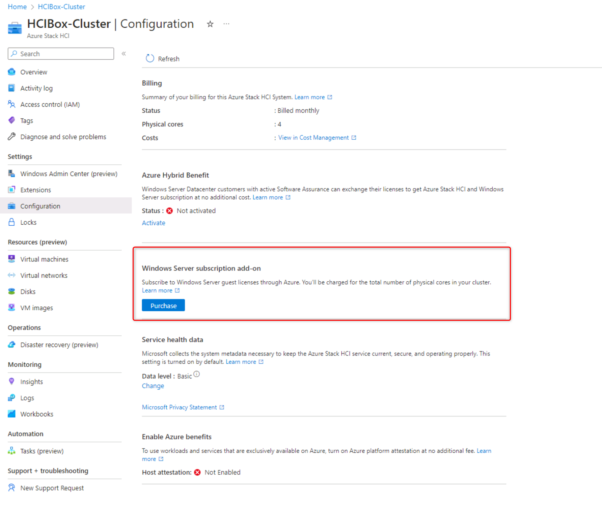

6. The 4th part on the  **configuration** page is where you can change the **Service Health Data** level which is send to, and collected by Microsoft. 
 
    Microsoft by default collects a basic set of system metadata necessary to keep the Azure Stack HCI service current, secure, and operating properly.
   
    **Learn more on:** https://learn.microsoft.com/en-us/azure-stack/hci/concepts/data-collection

    

7. The final part on the **configuration** page is where you can see if you have enabled the **Azure benefits** on your Azure Stack HCI 22H2 Cluster. Turning on Azure Benefits enables you to use these Azure-exclusive workloads on Azure Stack HCI:

    - **Windows Server Datacenter: Azure edition**
      - Version supported? 2022 edition or later
      - What it is? An Azure-only guest operating system that includes all the latest Windows Server innovations and other exclusive features.
    - **Extended Security Updates (ESUs)**
      - Version supported? October 12th, 2021 security updates or later
      - What it is? A program that allows customers to continue to get security updates for End-of-Support SQL Server and Windows Server VMs, now free when running on Azure Stack HCI.
    - **Azure Policy guest Configuration**
      - Version supported? Arc agent version 1.13 or later
      - What it is? A feature that can audit or configure OS settings as code, for both host and guest machines.
    - **Azure Virtual Desktop**
      - Version supported? For multi-session editions only. Windows 10 Enterprise multi-session or later.
      - What it is? A service that enables you to deploy Azure Virtual Desktop session hosts on your Azure Stack HCI infrastructure.
   
       **Learn more on:** https://learn.microsoft.com/en-us/azure-stack/hci/manage/azure-benefits

   
        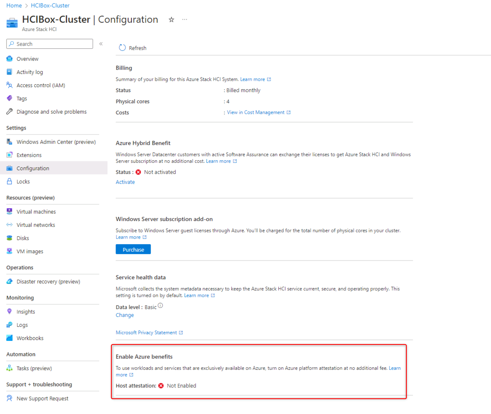 

### Monitor Insights on your Azure Stack HCI clusters using in Azure  ### 

In Task 1 of Exercise 2 you enabled the Monitoring Insights capabilities on the Azure Stack HCI cluster resource via the Azure Portal. Normally it takes around 15minutes to see the first data showing up i

1. In the "Search resources, services, and docs" search box at the top of the Azure Portal page, type **hciboxcluster** and under Resources, click **hciboxcluster**.

   

2. On the **hciboxcluster** page, under Monitoring, click **Insights**.

   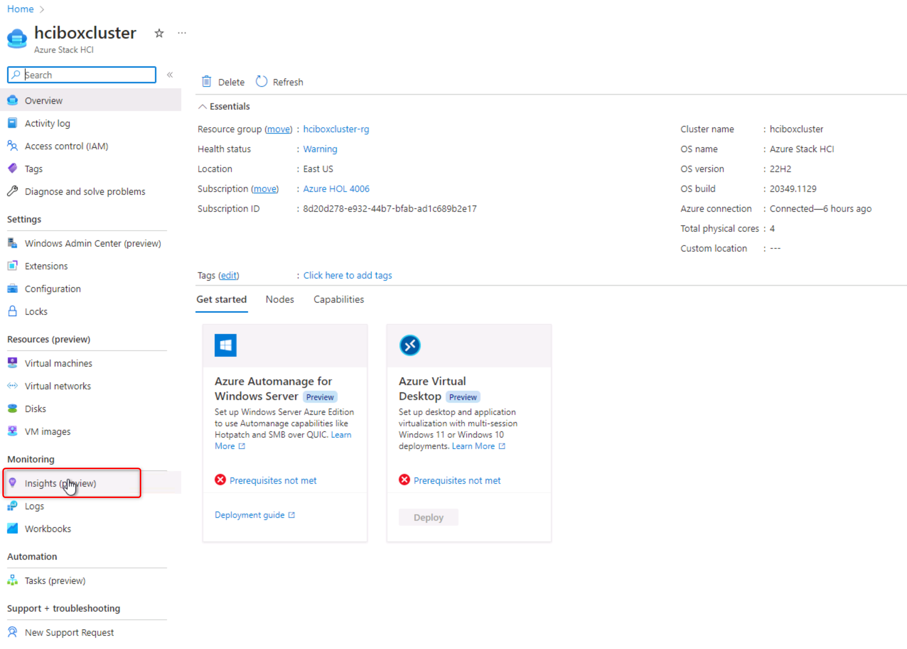

3. On the **Insights** page, Click **Auto refresh**, which is currently **Off**. Click **5 minutes**, and Click **Apply**

   

4. On the **Insights** page, Click **Health**. Notice that you see the same info you see on the Windows Admin Center Azure Stack HCI Cluster Dashboard.

    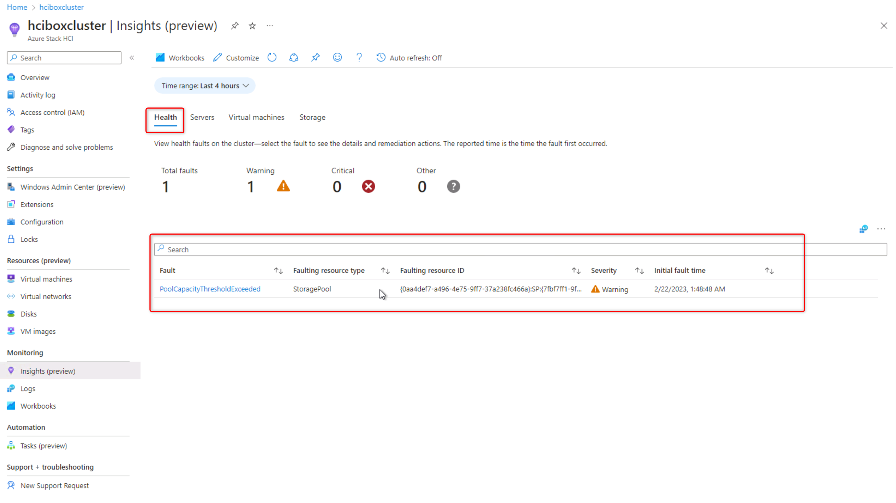
    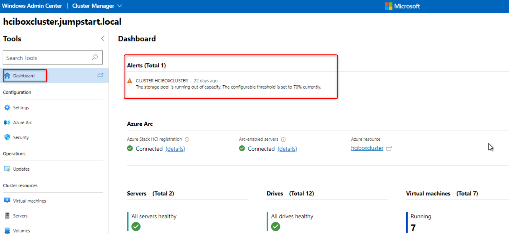

5. Click on **PoolCapacityThresholdExceeded** to see the details about the Fault.

    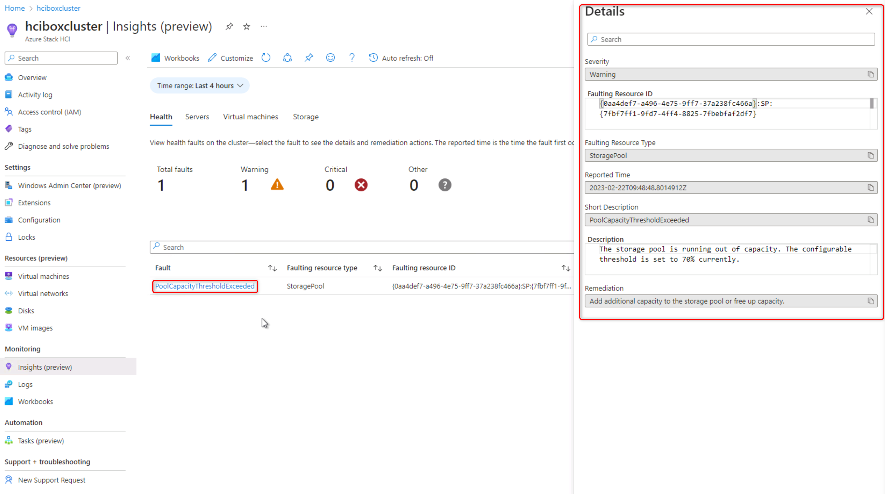

6. On the **Insights** page, Click **Server**. Here you will view health and usage info for the servers in the cluster.

    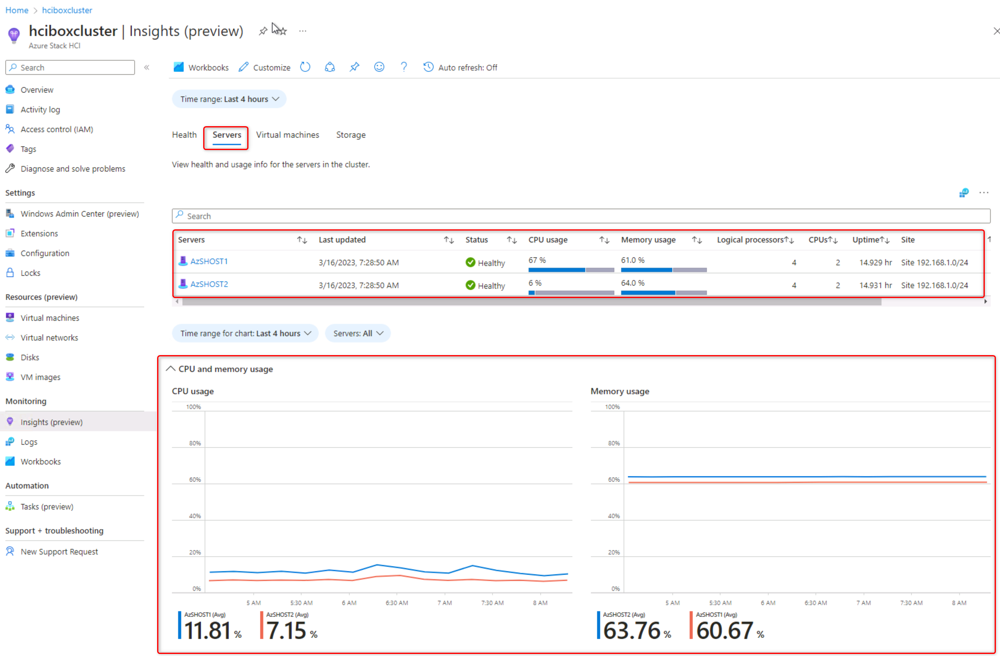

7. On the **Insights** page, Click **Virtual machines**. Here you will view the state of virtual machines on each server in the cluster.
   
    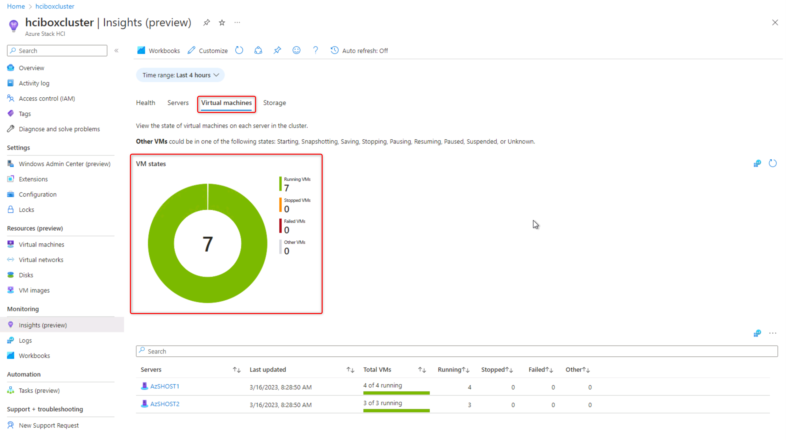

8. On the **Insights** page, Click **Storage**. Here you will view the health of volumes and drives in the cluster. Drive health is at the bottom of the page
   
    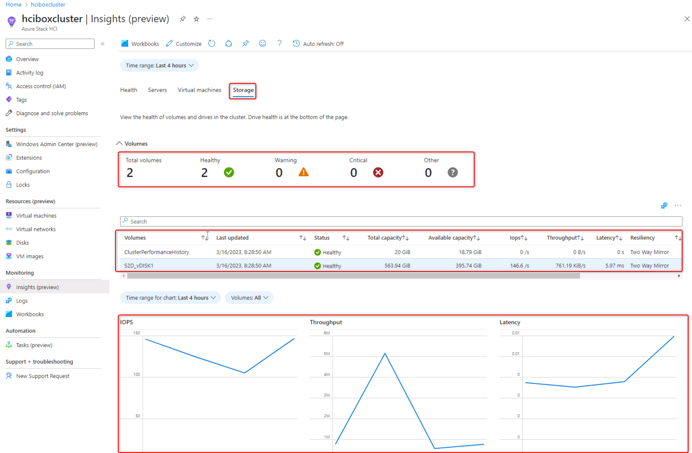   
    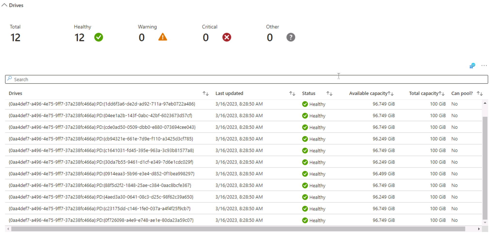 

Summary
-----------
In this exercise, you have enabled the Hybrid Azure Stack HCI Cluster features in the Azure Portal, reviewed the status of the Azure Arc services in the Windows Admin Center web portal, completed the pre-requirements to be able to connect and use the Windows Admin Center from the Azure Portal on the Azure Stack HCI Cluster, looked at the Azure Extensions on the Azure Stack HCI cluster in the Azure Portal, looked at all configuration capabilities on an Azure Stack HCI Cluster resource in the Azure Portal and finally looked at the data captured by the Monitoring Insights service on the Azure Stack HCI cluster in the Azure Portal.

With this completed, you can now move on to the next exercise.

Product improvements
-----------
If, while you work through this guide, you have an idea to make the product better, whether it's something in Azure Stack HCI, AKS on Azure Stack HCI, Windows Admin Center, or the Azure Arc integration and experience, let us know! We want to hear from you!

For **Azure Stack HCI**, [Head on over to the Azure Stack HCI Q&A forum](https://learn.microsoft.com/en-us/answers/tags/6/azure-stack-hci "Azure Stack HCI Q&A"), where you can share your thoughts and ideas about making the technologies better and raise an issue if you're having trouble with the technology.

For **AKS on Azure Stack HCI**, [Head on over to our AKS on Azure Stack HCI GitHub page](https://github.com/Azure/aks-hci/issues "AKS on Azure Stack HCI GitHub"), where you can share your thoughts and ideas about making the technologies better. If however, you have an issue that you'd like some help with, read on... 

Raising issues
-----------
This lab is based on the Azure Arc Jumpstart HCIBox: https://azurearcjumpstart.io/azure_jumpstart_hcibox/

If you want to setup the lab within your own Azure subscription please follow this link : https://azurearcjumpstart.io/azure_jumpstart_hcibox/#deployment-options-and-automation-flow

If you notice something is wrong with this guide, such as a step isn't working, or something just doesn't make sense - help us to make this guide better!
